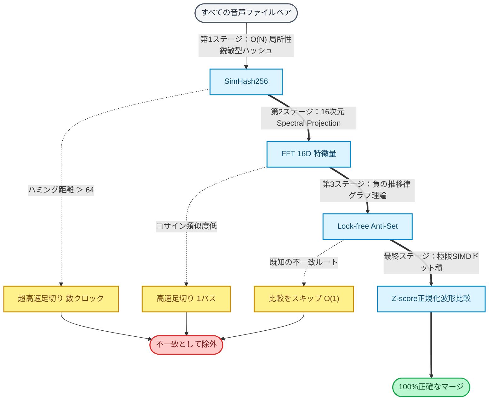

# BMS Part Tuner

# For Recruiters & Engineers (Technical Deep Dive)

If you are a recruiter or an engineer interested in the technical aspects of this project, please refer to the following English documentation. This project demonstrates high-performance optimization in **.NET 10** and **WPF**.

## Performance Highlights

- 8000x Speedup: Reduced audio processing time from 1 hour to 300 milliseconds.
- Tech Stack: .NET 10, SIMD (Vectorization), Memory-Mapped Files, MVVM, and DI.

## Key Documents

- [Technical Portfolio Summary](./docs/PORTFOLIO_SUMMARY_EN.md): A high-level overview of the architecture, optimization, and QA strategy.
- [Optimization Engineering Report](./docs/02_OPTIMIZATION_GUIDE_EN.md): A deep dive into how I achieved the 800x performance boost using low-level .NET techniques.

---

WAVファイルの類似度判定を、SIMD（CPUの並列計算）と空間の枝刈りアルゴリズム（三角不等式）を使って限界まで高速化した『超硬派な最適化エンジン』です。

普通にやるとメモリが爆発するか、処理に1時間かかる $O(N^2)$ の総当たり比較を、音響特性（RMS）の並び替えとポインタ管理（Flyweightパターン）だけで極限までサボる設計になっていて、爆速で動作します。AIを使わずに、ピュアな数学とアルゴリズムだけで力技をスマートに解決する、数学オタクの異常ともいえるほどの執念と執着が詰まったツールです。

# 限界を突破するための数理モデルとアーキテクチャ

BMSPartTunerが数万個の音声ファイルを「瞬時」に処理できるのは、AIのような曖昧な推論を一切排除し、**純粋な計算機科学（CS）と数理論理学**を突き詰めて計算空間を消滅させているからです。

## **推奨される制作ワークフロー**

本ツールは、特に以下のステップを含む現代的な楽曲制作フローで最大の効果を発揮します。

1. 生成AIによる楽曲の作成
2. AIツールを用いたステム（パートごとの音源）の分離
3. BMS・BMSONエディタでの譜面構築
4. 本アプリケーションBMS Part Tunerによる重複定義の統合と最適化
5. 完成したパッケージの公開

## **BMSアトリエ【極譜】からの制作メッセージ**

私たちは、クリエイターを単純作業から解放し、楽曲のクオリティアップという本来の創造的な作業に集中してもらうことを目指しています。  
「動作が軽く、管理しやすいデータ」を作ることは、プレイヤーへの配慮であると同時に、作品の完成度を高める重要な要素です。BMS Part Tunerは、その品質を支えるための信頼できるパートナーとなります。

## **動作環境**

- OS：Windows 10 / 11
- RAM：12GB以上を推奨します（余剰領域3GB以上確保推奨）
- CPU：AVX2命令セットに対応したCPU（非対応も可能、その場合はパフォーマンスが低下します）
- ランタイム：.NET 10.0 以降

## **ライセンス**

本プロジェクトは[BMS Part Tuner ソフトウェア使用許諾ライセンス](./LICENSE.md) のもとで公開されています。詳細は同梱のLICENSEファイルをご確認ください。

## **開発・サポート**

本ソフトウェアは[BMSアトリエ【極譜】](https://bms-atelier-kyokufu.blogspot.com/) によって開発・提供されています。
バグ報告や機能要望は、GitHubの[Issues](https://github.com/bms-atelier-kyokufu/BmsPartTuner/issues)で受け付けています。

開発者の方は[docs/Technical Guide.md](./docs/01_TECHNICAL_GUIDE_JP.md)をご覧ください。内部の仕組みを詳しく解説しています。
