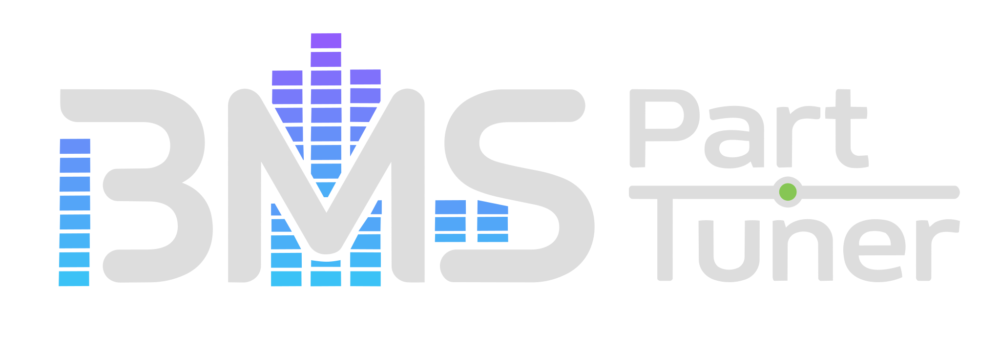

# BMS Part Tuner

[日本語で読む](README.md)

## About

**BMS Part Tuner** is a high-performance desktop application designed to instantly merge and optimize duplicate audio stems within BMS and BMSON chart formats. 
By employing pure computer science and mathematical logic, it radically reduces the bloated file sizes typically generated during AI-driven music production or stem separation workflows. This allows creators to focus on their creative vision rather than managing heavy, unoptimized data.

## Features

- **Blazing Fast (8000x Speedup)**: We transformed an $O(N^2)$ brute-force comparison that normally takes an hour into a lightning-fast process that completes in just 300 milliseconds.
- **Advanced Algorithmic Optimization**: Powered by SIMD (Vectorization), Flyweight pattern memory management, and spatial pruning (Triangle Inequality).
- **Modern UI**: Built with WPF (.NET 10) and Material Design, providing an intuitive and seamless user experience.

## Installation

1. **Prerequisites**:
   - OS: Windows 10 / 11
   - Runtime: [.NET 10.0 Desktop Runtime](https://dotnet.microsoft.com/download/dotnet/10.0) or later.
2. **Download**:
   - Grab the latest ZIP archive from the [Releases page](https://github.com/bms-atelier-kyokufu/BmsPartTuner/releases).
3. **Run**:
   - Extract the ZIP file to any folder and launch `BmsPartTuner.exe`. No installation required!

## Usage

1. Launch the application.
2. Drag and drop your target BMS/BMSON files or folders directly into the window.
3. If necessary, adjust the similarity threshold or configure your preview player path in the "Settings" menu.
4. Click **Optimize** to instantly merge duplicate audio stems and generate clean, lightweight chart data.

## Recommended Workflow

This tool is especially powerful in modern music production pipelines that include the following steps:

1. Music generation using AI models.
2. Stem separation using AI tools.
3. Chart construction in BMS/BMSON editors.
4. **Integration and optimization of duplicate definitions using BMS Part Tuner.**
5. Publishing the final, optimized package.

## Comprehensive Technical Documentation (For Engineers)

The algorithmic optimization details (Cascade Classifiers, SIMD, Lock-free Anti-Set, etc.) and deep architectural concepts that allow BMS Part Tuner to process tens of thousands of audio files instantly are published on our dedicated technical documentation site.

**[Read the Technical Documentation (GitHub Pages)](https://bms-atelier-kyokufu.github.io/BmsPartTuner/en/)**

## Requirements

- **OS**: Windows 10 / 11
- **RAM**: 12GB+ recommended (with at least 3GB of free space)
- **CPU**: CPU with AVX2 instruction set support (Works without it, but performance will degrade)
- **Runtime**: .NET 10.0 or later

## License

This project is licensed under the [BMS Part Tuner Software License](./LICENSE.md). Please see the included `LICENSE.md` file for details.

## Development & Support

This software is developed and provided by [BMS Atelier Kyokufu](https://bms-atelier-kyokufu.blogspot.com/).

Bug reports and feature requests are welcome via our GitHub [Issues](https://github.com/bms-atelier-kyokufu/BmsPartTuner/issues) page.

---

*Our goal is to free creators from tedious, repetitive tasks so they can focus on what truly matters: enhancing the quality of their music.
Producing data that is lightweight and easy to manage is not just a courtesy to players; it is a crucial element that elevates the overall perfection of the work. We hope BMS Part Tuner serves as a reliable partner in supporting that quality.*
