# BmsPartTuner Software Architecture

<div style="display: flex; justify-content: center;margin:1em;">
       
</div>

## Architecture Overview

This document describes the high-level architecture of BmsPartTuner. The application is built using WPF (.NET) and adopts the MVVM (Model-View-ViewModel) pattern to ensure maintainability and testability.

## Architecture Patterns

* **MVVM**: We adopt the Model-View-ViewModel pattern to separate UI logic from business logic. We use **CommunityToolkit.Mvvm** for efficient MVVM implementation.  
* **Dependency Injection (DI)**: We use **Microsoft.Extensions.DependencyInjection** to manage dependencies, promoting loose coupling between services and ViewModels.  
* **Service-Oriented**: Business logic is encapsulated within stateless services whenever possible to facilitate unit testing.

## Project Structure

The solution consists of the following main projects:

* **BmsAtelierKyokufu.BmsPartTuner**: The main WPF application containing UI, logic, and resources.  
* **BmsAtelierKyokufu.BmsPartTuner.Tests**: Unit and integration tests (xUnit).

## System Structure Diagram


<!-- https://www.mermaidchart.com/ -->
<!--
```mermaid
flowchart TB
 subgraph Controls["Custom Controls"]
        SCC["SlideConfirmationControl"]
        SFC["SmartFilterChips"]
        TC["ToastControl"]
 end
 subgraph View_Layer["View / UI"]
        MainWindow["MainWindow.xaml"]
        SettingsView["SettingsView.xaml"]
        Controls
 end
 subgraph Sub_ViewModels["Feature ViewModels"]
        FOVM["FileOperationsViewModel"]
        FLVM["FileListViewModel"]
        OVM["OptimizationViewModel"]
        SVM["SettingsViewModel"]
        NVM["NotificationViewModel"]
 end
 subgraph ViewModel_Layer["ViewModel"]
        MainVM["MainViewModel"]
        Sub_ViewModels
 end
 subgraph Service_Layer["Application Services"]
        FLFS["FileListFilterService"]
        SS["SettingsService"]
        RCS["ResultCardService"]
        LLS["LicenseLoaderService"]
        DDS["DragDropService"]
        TNS["ToastNotificationService"]
        TS["ThemeService"]
 end
 subgraph Audio_Engine["Audio Processing"]
        PACE["ParallelAudioComparisonEngine"]
        FWC["FastWaveCompare"]
        INDS["InstrumentNameDetectionService"]
 end
 subgraph Bms_Core["BMS Management"]
        BM["BmsManager"]
        BFR["BmsFileRewriter"]
        SE["SimulationEngine"]
 end
 subgraph Core_Layer["Domain Logic / Engine"]
        BOS["BmsOptimizationService"]
        Audio_Engine
        Bms_Core
 end
    MainWindow --\> MainVM
    SettingsView --\> SVM
    SCC -.-\> OVM
    SFC -.-\> FLVM
    MainVM --\> FOVM & FLVM & OVM & SVM & NVM
    FLVM --\> FLFS
    OVM --\> BOS
    SVM --\> SS & TS & LLS & LLS
    BOS --\> PACE & BM & BFR & SE
    PACE --\> FWC
    FLFS --\> INDS

    %% クラス定義：ここで青統一スタイルを適用
    classDef blueNode fill:#FFFFFF,stroke:#1565C0,stroke-width:1px,color:#0D47A1;
    classDef blueCluster fill:#E3F2FD,stroke:#64B5F6,stroke-width:2px,color:#0D47A1,rx:10,ry:10;

    style Controls fill:#F2F7FF,stroke:#8CBCFF,color:#001D36,stroke-dasharray: 5 5
    style Sub_ViewModels fill:#F2F7FF,stroke:#8CBCFF,color:#001D36,stroke-dasharray: 5 5
    style Audio_Engine fill:#F2F7FF,stroke:#8CBCFF,color:#001D36,stroke-dasharray: 5 5
    style Bms_Core fill:#F2F7FF,stroke:#8CBCFF,color:#001D36,stroke-dasharray: 5 5
    
    %% 全ノードとクラスターに適用
    class SCC,SFC,TC,MainWindow,SettingsView,FOVM,FLVM,OVM,SVM,NVM,MainVM,FLFS,SS,RCS,LLS,DDS,TNS,TS,PACE,FWC,INDS,BM,BFR,SE,BOS blueNode;
    class Controls,View_Layer,Sub_ViewModels,ViewModel_Layer,Service_Layer,Audio_Engine,Bms_Core,Core_Layer blueCluster;
-->

## **Directory Structure & Responsibilities**

The main project (BmsAtelierKyokufu.BmsPartTuner) is organized as follows:

### 1\. Core Logic (/Core)

Contains pure domain logic independent of the UI layer.

* **Bms/**: Logic for parsing, modifying, and rewriting BMS files (BmsFileRewriter, BmsManager).  
* **Optimization/**: Core algorithms for file partitioning and combination simulation (SimulationEngine).  
* **Validation/**: Validation logic for user input and BMS file integrity (BmsValidators).  
* **Helpers/**: Domain-specific helper algorithms (e.g., AudioFileGroupingStrategy, RadixConvert).

### 2\. Audio Processing (/Audio)

Handles low-level audio operations and waveform analysis.

* **FastWaveCompare**: Optimized algorithms for comparing audio waveforms.  
* **WaveValidation**: Logic for verifying audio file formats.  
* **AudioCacheManager**: Audio data caching mechanism for performance improvement.

### 3\. Application Services (/Services)

Coordinates interactions between the UI (ViewModels) and Core/Audio logic.

* **BmsOptimizationService**: Facade service that orchestrates the BMS optimization process.  
* **AudioPreviewService**: Audio playback and preview logic using NAudio.  
* **InputValidationService**: Validates user input across the entire application.  
* **SettingsService**: Manages persistent application settings.

### 4\. UI Layer (/Views, /Controls, /ViewModels, /Themes)

* **ViewModels/**: Holds presentation logic and state.  
* **Controls/**: Reusable user controls (e.g., SmartFilterChips, SlideConfirmationControl) and specific view components.  
* **Themes/**: XAML resources, styles, and control templates (Design tokens, Dark/Light themes).

### 5\. Infrastructure (/Infrastructure)

WPF-specific infrastructure and helpers.

* **Behaviors/**: Attached behaviors for UI interactions (e.g., DragDropBehavior, NumericInputBehavior).  
* **UI/**: UI-specific helper classes.

## Data Flow

1. **User Interaction**: The user interacts with the View (Window/UserControl).  
2. **ViewModel**: The View is bound to the ViewModel. The ViewModel handles commands and updates state.  
3. **Service Layer**: The ViewModel calls services (e.g., IBmsOptimizationService) to perform operations.  
4. **Core/Audio**: Services delegate complex calculations and file operations to Core and Audio components.  
5. **Model**: Data is passed using Models (DTOs).

## Safety Mechanisms

To protect critical user data, the following safety mechanisms are implemented:

1. Atomic File Saving:  
   * BmsFileRewriter never overwrites files directly.  
   * It follows the procedure: Write to Target.tmp → Backup/Delete Target.bms → Rename Target.tmp to Target.bms.  
2. UX Friction for Physical Deletion:  
   * When the option to delete source audio files is enabled, the operation direction of the confirmation slide UI (SlideConfirmationControl) is **forcibly changed from "Left-to-Right" to "Right-to-Left"**.  
   * This design leverages mental models to prevent accidental operations due to habit, encouraging users to make careful decisions.

## Tech Stack

* **Runtime**: .NET 10.0 (WPF)  
* **Audio IO**: NAudio (Wasapi / WaveStream)  
* **MVVM**: CommunityToolkit.Mvvm  
* **Markdown**: Markdig.Wpf (For license display)  
* **UI Framework**: Material Design 3 (Original Custom Implementation based on XAML)  
* **Parallelism**: Task Parallel Library (TPL) / PLINQ