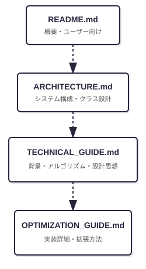
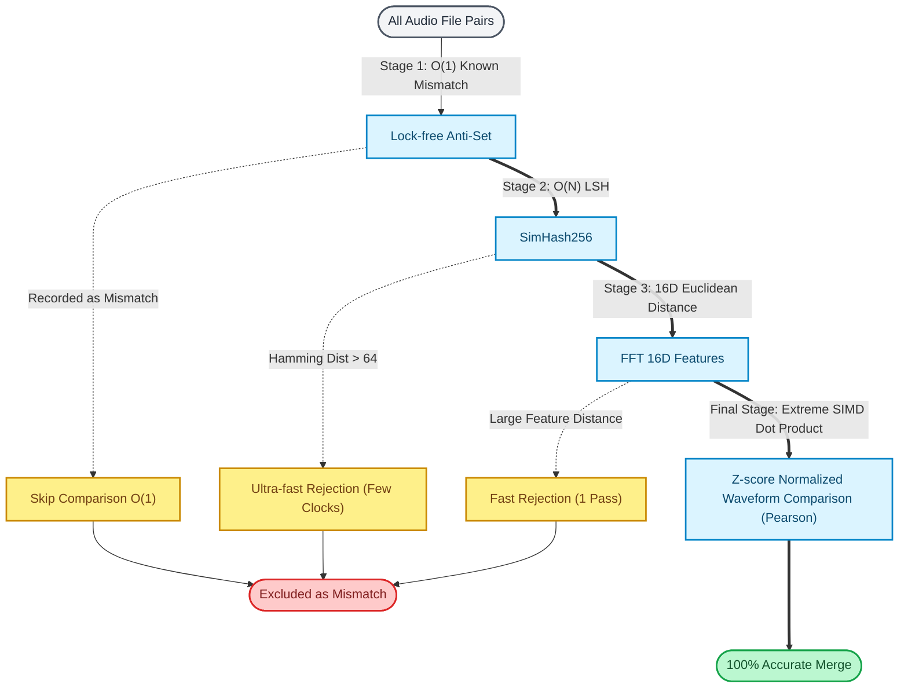

# BMS Part Tuner: Technical Guide

BMS Part Tuner is a creator-focused utility that deeply integrates with BMS and bmson data structures, employing a linear algebra-based approach and a cascade classifier algorithm to optimize definitions.
This document details the mathematical foundations of our algorithms, the underlying architecture, and the specific techniques utilized for extreme performance optimization.

## Background and Objectives (The "Why")

In modern BMS production workflows—especially those leveraging Generative AI for music creation and AI stem separation—the chart construction process in the bmson format often yields thousands of individual audio fragments.
This inevitably leads to waveform-level redundant definitions, causing severe project bloat and runtime memory pressure for end-users.

This project was engineered to solve this exact problem, shifting the burden from "manual creator effort" to "logical identity evaluation." Our primary goal is to achieve the absolute minimal definition structure without compromising the perceived auditory quality.

## Architecture and Design Philosophy

The project is built on .NET 10 and WPF, prioritizing high maintainability and strict type safety.

### Separation of Concerns (SoC)

Respecting WPF's core design philosophy, we have strictly applied the MVVM pattern. The UI logic and the optimization engine are completely decoupled. This ensures highly flexible testing through Dependency Injection (via `Microsoft.Extensions.DependencyInjection`).

- **Infrastructure** : Utilizes Behavior-based functional extensions to implement complex UI interactions while maintaining the declarative nature of XAML.
- **Services** : Abstracts audio playback, file I/O, and optimization logic, ensuring components are easily interchangeable and testable.
- **Design Tokens** : Centralizes resource definitions (colors, properties) to guarantee UI consistency across the application.

## Core Algorithm: The 4-Stage Cascade Classifier

Evaluating waveform identity for tens of thousands of file combinations using heavy arithmetic results in $O(N^2)$ time complexity, which is computationally prohibitive.
To solve this, BMS Part Tuner employs a "Cascade Classification Algorithm," applying lightweight screening methods first to quickly reject non-matching pairs (early pruning), reserving the most intensive calculations only for strong candidates.

### Stage 1: Lock-free Anti-Set (Mismatch Cache)

At the very front of the comparison logic lies the `ThreadSafeReplaceTable` (Anti-Set), which records pairs that have already been evaluated as "mismatched" in previous iterations.
Using a BitArray (e.g., bitmasks of 64-bit integers), this stage allows thread-safe, $O(1)$ skipping of known mismatched pairs without any audio processing.

### Stage 2: SimHash256 (Locality-Sensitive Hashing)

A 256-bit hash (SimHash) is computed from the waveform. During comparison, the **Hamming Distance** between the two hashes is calculated.
By utilizing the hardware-level `POPCNT` instruction (which counts the number of set bits), this stage performs a coarse similarity check in just a few CPU cycles, instantly rejecting completely different sounds.

### Stage 3: FFT 16D Feature Extraction

For pairs that pass Stage 2, the algorithm extracts 16-dimensional frequency band energy features using the Fast Fourier Transform (FFT).
It calculates the **Euclidean Distance** between the two 16D vectors, pruning audio files that clearly possess different spectral characteristics.

### Stage 4: Quantitative Evaluation via Pearson Correlation (SIMD)

The final stage determines the ultimate similarity by quantifying the resemblance of the waveform's "shape" on a scale from $0.0$ to $1.0$ using Pearson correlation:

$$r = \frac{\sum_{i=1}^{n} (x_i - \bar{x})(y_i - \bar{y})}{\sqrt{\sum_{i=1}^{n} (x_i - \bar{x})^2 \sum_{i=1}^{n} (y_i - \bar{y})^2}}$$

Because audio waveforms naturally exhibit a mean amplitude ($\bar{x}, \bar{y}$) extremely close to $0$, we mathematically simplify this equation to the equivalent of Cosine Similarity. This transformation drastically reduces the computational cost:

$$r \approx \frac{\sum_{i=1}^{n} x_i y_i}{\sqrt{\sum_{i=1}^{n} x_i^2} \sqrt{\sum_{i=1}^{n} y_i^2}}$$

This calculation is heavily vectorized using **SIMD (Single Instruction, Multiple Data)**, processing multiple samples in parallel to achieve extreme execution speeds.

#### Amplitude Invariance and Implicit Normalization

A critical feature of this algorithm is its independence from amplitude scaling (volume differences). Mathematically, the correlation coefficient $r$ is invariant to the scalar multiplication of vectors $x, y$. 
This completely eliminates the need to perform a "Normalization" preprocessing step to equalize audio volume. Even if minute volume differences exist, waveforms with identical "shapes" are correctly identified.

## Project Documentation

For detailed specifications and design guidelines, please refer to the following documents:

- [Architecture (00_ARCHITECTURE_EN.md)](00_ARCHITECTURE_EN.md)
  Overview of the entire system's component structure and class design.
- [Optimization Guide (02_OPTIMIZATION_GUIDE_EN.md)](02_OPTIMIZATION_GUIDE_EN.md)
  Scope of optimization logic and specific processing flows.
- [Bmson Down-conversion (05_BMSON_CONVERSION_EN.md)](05_BMSON_CONVERSION_EN.md)
  Explanation of memory optimization and caching mechanisms in bmson to BMS down-conversion.
- [Commit Message Guide (COMMIT_MESSAGE_GUIDE_EN.md)](COMMIT_MESSAGE_GUIDE_EN.md)
  Commit conventions for participating in development.
- [Test Strategy (04_TEST_STRATEGY_EN.md)](04_TEST_STRATEGY_EN.md)
  Design guidelines for unit and mutation testing.