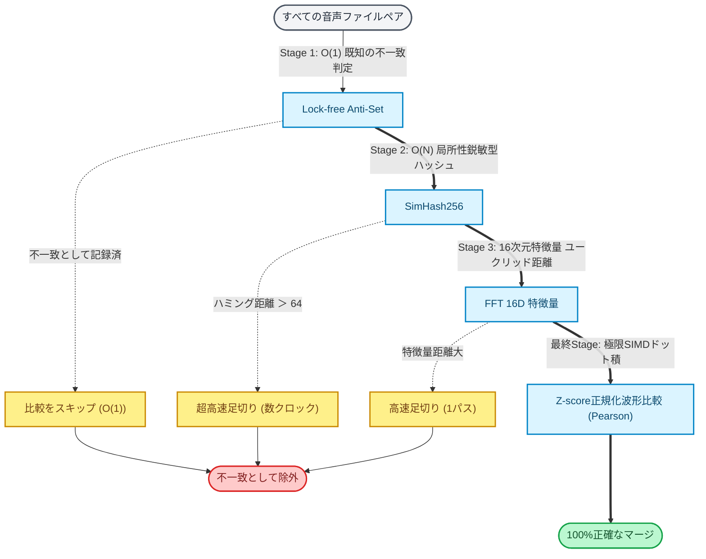

# BMS Part Tuner テクニカルガイド

       

BMS Part Tunerは、BMSおよびbmson形式のデータ構造を深く理解し、線形代数的アプローチとカスケードアルゴリズムで定義の最適化を行うクリエイター向けツールです。
本ドキュメントでは、採用されているアルゴリズムの数学的根拠、アーキテクチャ、およびパフォーマンス最適化の手法について解説します。

## 開発の背景と目的

現代のBMS制作ワークフロー、特に生成AIによる楽曲生成とAIステム分離を活用する環境では、bmson形式での譜面構築プロセスにおいて数千規模の音声断片が発生します。
この過程で波形レベルでの重複定義が不可避的に発生し、プロジェクトの肥大化や実行時のメモリ圧迫を招いています。

本プロジェクトは、この課題を「制作者の手作業」ではなく「論理的な同一性評価」によって解決し、聴覚上の音質を極力損なうことなく最小の定義構成を実現することを目指して設計されました。

## アーキテクチャと設計思想

本プロジェクトは .NET 10 および WPF を基盤とし、高いメンテナンス性と型安全性を確保しています。

### 関心の分離

WPFの設計思想を尊重し、MVVMパターンを厳格に適用しました。UIロジックと最適化エンジンは完全に分離されており、Microsoft.Extensions.DependencyInjection による依存性の注入を通じて柔軟なテストを可能にしています。

* **Infrastructure**: Behaviorベースの機能拡張により、XAMLの宣言的記述を維持しつつ複雑なUI操作を実現。  
* **Services**: 音声再生、ファイルIO、最適化ロジックを抽象化し、交換可能な設計を採用。  
* **Design Tokens**: UIの整合性を保つため、色やプロパティは一元管理されたリソース定義を参照。

## コア・アルゴリズム: 4段階のカスケード分類器

音声の同一性判定において、数万の組み合わせすべてに対して高負荷な波形比較を行うと計算量が $O(N^2)$ となり非現実的です。
BMS Part Tunerはこれを解決するため、計算負荷の低い手法から順に適用し、一致しないものを早期に除外（足切り）する「カスケード分類アルゴリズム」を採用しています。

### Stage 1: Lock-free Anti-Set (不一致キャッシュ)

比較ロジックの最前段には、過去の比較で「一致しなかった」という結果を記録する `ThreadSafeReplaceTable` (Anti-Set) が存在します。
BitArray（64ビット長整数配列のビットマスク等）を用いることで、スレッドセーフかつ $O(1)$ で「すでに不一致であることが分かっているペア」を即座にスキップします。

### Stage 2: SimHash256 (局所性鋭敏型ハッシュ)

波形から256ビットのハッシュ（SimHash）を計算し、比較時は2つのハッシュの **ハミング距離** を計算します。
ハードウェアレベルの `POPCNT` 命令（立っているビットの数を数える命令）を使用することで、数クロックという極小のコストで波形の類似性を大まかに判定し、全く異なる音声を即座に除外します。

### Stage 3: FFT 16次元特徴量抽出

さらに絞り込まれたペアに対して、高速フーリエ変換（FFT）によって抽出された16次元の周波数帯域ごとのエネルギー特徴量を使用します。
2つの16次元ベクトル間の **ユークリッド距離** を計算し、周波数特性が明らかに異なる音声を除外します。

### Stage 4: ピアソンの積率相関係数による定量的評価 (SIMD)

最終的な類似性の判定には、波形の「形」の類似度を $0.0$ 〜 $1.0$ の範囲で定量化するピアソン相関を使用します。

$$r = \frac{\sum_{i=1}^{n} (x_i - \bar{x})(y_i - \bar{y})}{\sqrt{\sum_{i=1}^{n} (x_i - \bar{x})^2 \sum_{i=1}^{n} (y_i - \bar{y})^2}}$$

オーディオ波形は平均値 $\bar{x}, \bar{y}$ が $0$ に極めて近いという性質を持つため、実装上は以下のコサイン類似度と同等の簡略式へ変形し、演算コストを大幅に削減しています。

$$r \approx \frac{\sum_{i=1}^{n} x_i y_i}{\sqrt{\sum_{i=1}^{n} x_i^2} \sqrt{\sum_{i=1}^{n} y_i^2}}$$

この計算は **SIMD (Single Instruction, Multiple Data)** を用いてベクトル化され、複数のサンプルを並列に処理することで劇的な高速化を実現しています。

#### 振幅不変性と自動正規化

本アルゴリズムの重要な特性は、振幅のスケール（音量差）に依存しない点にあります。相関係数 $r$ はベクトル $x, y$ のスカラー倍に対して不変です。
これにより、事前に音声ファイルの音量を均一化（ノーマライズ）する必要がなく、微細な音量差があっても「波形の形状」が同一であれば正しく識別します。

## プロジェクト内ドキュメント

詳細な仕様や設計方針については、以下のドキュメントを参照してください。

* [アーキテクチャ概要 (00_ARCHITECTURE_JP.md)](00_ARCHITECTURE_JP.md)
  システム全体のコンポーネント構成とクラス設計の概要。  
* [最適化ガイド (02_OPTIMIZATION_GUIDE_JP.md)](02_OPTIMIZATION_GUIDE_JP.md)
  最適化ロジックの適用範囲と具体的な処理フロー。  
* [bmson変換システム (05_BMSON_CONVERSION_JP.md)](05_BMSON_CONVERSION_JP.md)
  bmson形式からのダウンコンバートにおけるメモリ最適化とキャッシュ機構の解説。
* [コミット規約 (COMMIT_MESSAGE_GUIDE_JP.md)](COMMIT_MESSAGE_GUIDE_JP.md)
  開発に参加する際のコミット規約。
* [テスト設計 (03_TEST_DESIGN_JP.md)](03_TEST_DESIGN_JP.md)
  ユニットテストおよびミューテーションテストの設計方針。  

**ADR（Architecture Decision Records）とコードの紐付け**:
`docs/adr/` 配下に設計上の重要な意思決定が保存されています。コードの該当箇所には `[ADRAnchor("ADR-ID", nameof(TypeName))]` 属性が付与されており、コードと設計ドキュメントの双方向のトレーサビリティを確保しています。変更時には ADR の確認と更新を意識してください。
