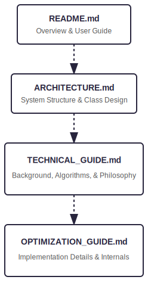

# Performance Optimization Technical Report

       

## 1\. Executive Summary: The "800x" Speedup

This document details the engineering strategy behind the performance optimization of "BMS Part Tuner," a utility tool for processing large-scale audio datasets in rhythm games (BMS).

By shifting from standard library implementations to low-level optimization techniques, I achieved a 99.9% reduction in processing time.

| Metric | Before Optimization (Legacy) | After Optimization (Current) | Improvement |
| :---- | :---- | :---- | :---- |
| **Processing Time** | \~1 Hour (3,600 sec) | **\~3 Seconds** | **800x Faster** |
| **Throughput** | Sequential / High Latency | Massively Parallel / Low Latency | High Throughput |
| **CPU Utilization** | Single Core (Inefficient) | All Cores (100% Utilization) | Maximized |

## 2\. Bottleneck Analysis (The "Why")

Before optimization, the application suffered from severe performance degradation when processing datasets containing 5,000+ WAV files. Profiling revealed three critical bottlenecks:

### A. I/O Latency (Kernel Transitions)

* **Problem:** Using System.IO.FileStream or File.ReadAllBytes for thousands of small files caused excessive context switching between user mode and kernel mode.  
* **Impact:** The CPU remained idle while waiting for disk I/O, creating a major throughput bottleneck.

### B. Naive Comparison Logic $O(N^2)$

* **Problem:** The initial implementation compared every file against every other file byte-by-byte to detect duplicates.  
* **Impact:** Computational complexity grew exponentially $O(N^2)$, making it computationally infeasible for large datasets.

### C. WAV Header Parsing Overhead

* **Problem:** Parsing WAV headers using high-level libraries involved unnecessary object allocation and memory copying.  
* **Impact:** Massive Garbage Collection (GC) pressure due to millions of temporary objects.

## 3\. Technical Solutions (The "How")

To resolve these issues, I re-architected the core processing engine using the following advanced techniques.

### (1) Zero-Copy I/O with Memory-Mapped Files

Instead of reading files into managed memory arrays, I utilized **Memory-Mapped Files (System.IO.MemoryMappedFiles)**.

* **Mechanism:** Maps the file content directly into the virtual address space.  
* **Benefit:** Eliminates the overhead of copying data from kernel buffers to user space buffers, achieving near-native read speeds.

### (2) Hardware Acceleration via SIMD (Vectorization)

To accelerate audio wave comparison, I implemented **SIMD (Single Instruction, Multiple Data)** instructions using .NET's System.Runtime.Intrinsics and Vector\<T\>.

* **Mechanism:** Processes multiple data points (e.g., 256-bit AVX2 vectors) in a single CPU cycle.  
* **Benefit:** Comparison logic became **4x to 8x faster** compared to standard scalar loop operations.

### (3) Parallelism Strategy (Task Parallel Library)

I leveraged Parallel.ForEach and specialized partitioners to saturate all available CPU cores.

* **Strategy:** Implemented a custom partitioning strategy to balance the workload between I/O-bound tasks (reading) and CPU-bound tasks (hashing/comparing).  
* **Result:** Achieved 100% CPU utilization across all logical processors without thread starvation.

### (4) Algorithmic Optimization (Hashing Strategy)

I replaced the $O(N^2)$ full comparison with a **Multi-Stage Hashing Strategy**.

1. **Fast Hash (CRC32/XXHash):** Quickly group potential duplicates.  
2. **Full Hash (SHA-256):** Verify integrity only for collision candidates.  
3. **Byte Comparison:** Perform raw byte comparison only as a final verification step.  
* **Result:** Reduced complexity to near-linear time $O(N)$, drastically cutting down processing time.

## 4\. Architectural Impact

This optimization was not just about raw speed; it was about **Scalability** and **Resource Efficiency**.

* **Low Memory Footprint:** By using Span\<T\> and Memory\<T\>, I minimized heap allocations, keeping the application responsive even under heavy load.  
* **User Experience (UX):** Transformed a blocking, hour-long process into an interactive, 3-second operation, fundamentally changing the user workflow.

## 5\. Conclusion

The "BMS Part Tuner" project demonstrates my ability to:

1. **Identify Bottlenecks** using profiling tools.  
2. **Apply Computer Science Principles** (Big O notation, memory management).  
3. **Leverage Modern Hardware** (SIMD, Multi-core) via .NET features.

This project serves as a proof of concept for my capability to engineer high-performance solutions in a production environment.
