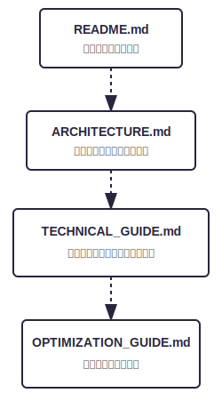
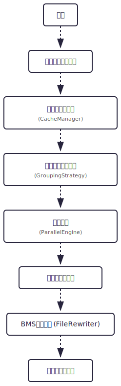

# BMS Part Tuner - 最適化実装ガイド

       

本ドキュメントは、BMS Part Tunerの最適化エンジンの実装詳細を解説する**技術者向け深掘りガイド**です。

本ドキュメントを最大限に活用するには、以下の前提知識があると便利です：

* 線形代数（ベクトル、内積、ノルム）
* 信号処理（サンプリング、RMS）
* .NET/C#（並列処理、メモリ管理）
* マルチスレッド設計パターン
---

## 最適化実装ガイドにおける変数定義の解説

 ### 1. 計算量理論に関する変数 (Complexity Analysis)
--------------------------------------------------
これらの変数は、主に「処理にどれくらいの時間がかかるか」を見積もるために使用されています。

- $n$ : 総対象数（行数、または総ファイル数）
    - 意味: 処理のベースとなるデータ量です。BMS解析やプリロードなど、全データを1回ずつ触る処理は $O(n)$ になります。
- $m$ : グループサイズ（特定のグループに含まれるファイル数）
    - 意味: ファイルサイズやRMS（音量）が似通った「比較対象候補」の数です。
    - なぜ重要か: 実装ガイドの $O(\sum{m^2})$ という表記は、グループ内でのペア比較（総当たり）を意味します。グループ化が上手く機能し m が小さくなれば、計算時間は劇的に短縮されます。
- $T$ : しきい値の試行回数 (Threshold count)
    - 意味: 0.01刻みなどでシミュレーションを行う際の、ループの回数です。
- $k$ : イテレーション（反復）のインデックス
    - 意味:総和計算における「反復変数」です。
    - $\sum_{k=1}^{T}$ のように「1番目のしきい値から $T$番目まで」を数え上げるためのカウンタ変数です。

### 2. 信号処理・統計学に関する変数 (Signal Processing)
--------------------------------------------------
音声波形の類似度を判定するための数式で使用されています。

- $r$ : ピアソン相関係数
    - 意味: 2つの波形がどれくらい似ているかを示す指標（$-1.0$ 〜 $1.0$）。$1.0$に近いほど「同じ音」と判定されます。
- $R^2$ : 決定係数
    - 意味: 回帰モデルの当てはまりの良さを示す指標。実装上は相関係数の二乗に近い意味合いで、判定精度を補強します。
- $x, y$ : 波形データ（信号ベクトル）
    - 意味: 比較する2つの音声データそのものを指します。
- $\hat{x}, \hat{y}$ : 正規化済み波形データ
    - 意味: 平均を0、ノルム（長さ）を1に調整したデータ。これにより、音量の大小に関わらず「波形の形」だけで比較可能になります。
- $RSS$ : 残差平方和
    - 意味: 2つの波形の「ズレ」の合計です。これが小さいほど、波形が一致していることを示します。
- $DSS$ : 偏差平方和
    - 意味: データ全体の「ばらつき」です。RSSをこれで割ることで、データの規模に左右されない相対的な誤差を算出します。

### 3. 組み合わせ論・基数変換に関する変数 (Combinatorics)
--------------------------------------------------
BMSの「定義枠（#WAV）」をどれだけ確保できるかを計算するために使用されます。

- $R$ : 基数
    - 意味: 数値の数え方の底。標準BMSは 36 通りの文字列(0-9, A-Z)、本ツールの拡張モードは 62 通りの文字列(0-9, A-Z, a-z) です。
- $L$ : 桁数
    - 意味: BMS定義番号の桁数（通常は 2 固定）。
- $C$ : 容量
    - 意味: 使用可能な最大定義数。$C = R^L - 1$ という式で、最大何種類の音を鳴らせるかが決まります。
- $i$ : 整数インデックス
    - 意味: 内部で管理している $0, 1, 2...$ という連番です。これを BaseConv 関数で `'01', '0A'` などのBMS用文字列に変換します。

## **クラス設計**

### **コアクラス**

#### **BmsOptimizationService**（サービス層のオーケストレータ）

**責務**: 全体のワークフローを制御・統合

#### **SimulationEngine**（しきい値探索の評価器）

**責務**: 複数のしきい値で「削減後ユニーク数」を推定し、しきい値探索に必要な系列データを作る。

- エントリポイント（実装）
  - `RunParallelSimulation(rangeMin, rangeMax, step, progress)`
    - しきい値リストを**降順**に生成し、しきい値ごとのシミュレーションを**順次**実行
    - Base36条件（1295件以下）を満たした時点で早期終了
    - しきい値ごとの内部（SimulateThreshold）では、グループ単位で `Parallel.ForEach` により並列化
  - `RunParallelSimulationDetailed(...)`
    - しきい値自体も `Parallel.ForEach` で並列化する別実装（サービス層では現状未使用）

- 計算量（概算）
  - しきい値数を $T$、グループサイズを $m$ とすると
    - しきい値探索: $O\left(\sum_{k=1}^{T}(n + \sum m^2)\right)$
  - 実装は「降順 + Base36成立で早期終了」するため、実運用では $T$ が小さくなる（=高速化）。

---

### **ファイル管理層**

#### **FileList**

**責務**: 1つのBMSファイルに対して、#WAV定義を解析し、WAVファイルのメタ情報リスト（`WavFiles`）を作成・保持する。

#### **BmsManager**

**責務**: BMSの行解析と、譜面データ内の定義番号置換のための低レベルユーティリティ。

#### **BmsFileRewriter**

**責務**: 置換テーブル（replaces）に基づき、#WAV定義と譜面データを整列・書き換えして出力する。

- 計算量の目安
  - BMS読み込み/書き換え: $O(n)$（行数）
  - 置換（譜面データ部）: $O(m)$（置換対象の譜面行数 × 文字列長に比例）

---

### **キャッシュ管理層**

#### **AudioCacheManager**

**責務**: 音声データのオンメモリ管理

- 職責
  - 音声ファイルの並列プリロード
  - バッチ処理による効率化
  - メモリ使用量の統計出力（推定）
  - 破損ファイル等の失敗を収集して呼び出し元へ返却

- 最適化戦略
  - バッチサイズ: $\max(10, \lfloor \frac{\text{totalFiles}}{\text{cores} \times D}\rfloor)$（$D$ は定数、実装は AppConstants.Cache.BatchSizeDivisor）
  - バッチ間: 並列（MaxDegreeOfParallelism = Environment.ProcessorCount）
  - バッチ内: 順次（ディスク負荷を抑え、シークを減らす）
  - 進捗レポート: バッチ単位

#### **CachedSoundData**

**責務**: 音声データのメモリ表現（POCO）

- 職責
  - 波形データの保持（オンメモリキャッシュ）
  - チャンネル分離（デインターリーブ）済みの配列を提供
  - RMS（TotalRms）と、Phase 2 用の正規化波形（NormalizedWaveform）を事前計算
  - 推定メモリ使用量を算出

- メモリ使用量の概算
  - 1秒の音声（44.1kHz, ステレオ）の場合
    - サンプル数: $44{,}100\,\text{samples/ch} \times 2\,\text{ch} = 88{,}200$
    - メモリ: $88{,}200 \times 4\,\text{bytes} \approx 352.8\,\text{KB}$
  - 30秒の音声の場合
    - $352.8\,\text{KB} \times 30 \approx 10.6\,\text{MB}$

---

### **グループ化層**

#### **AudioFileGroupingStrategy**

**責務**: 効率的なファイルグループ化による比較最適化

### **比較エンジン層**

#### **ParallelAudioComparisonEngine**

**責務**: マルチスレッド音声比較とマッチング

- 職責（実装ベース）
  - グループ単位での並列比較（Parallel.ForEach）
  - 置換テーブル（int[]）の更新（CAS / Interlocked）
  - 進捗レポート

- 並列化戦略
  - グループ間: 並列（MaxDegreeOfParallelism = Environment.ProcessorCount）
  - グループ内: 順次（RMSでソートし、近傍のみ比較）

- グループ内アルゴリズム（Sort & Sweep）
  1. group を RMS 昇順でソート
  2. i を先頭から走査し、後続 j を「近傍だけ」比較
     - RMS が上限を超えたら break（ソート済みのため）
     - RMS範囲（例）: 非無音なら $[rms\times 0.8,\ rms\times 1.25]$、無音なら $[0,\ 0.002]$

- 比較の fast/slow path
  - fast path 1: ファイル名一致
  - fast path 2: AudioFingerprint 一致
  - slow path  : FastWaveCompare.IsMatch

#### **FastWaveCompare**

**責務**: CachedSoundData 同士を相関係数で一致判定（実装はシンプルな短絡判定）

- 判定対象（実装）
  - SampleRate / Channels / BitsPerSample
  - TotalSamples（完全一致を要求）
  - ピアソン相関係数 $r$（$-1.0 \le r \le 1.0$）

- IsMatch(data1, data2, threshold) の処理フロー
  1. フォーマット一致チェック
  2. 長さ一致チェック（TotalSamples）
  3. 相関係数の計算（チャンネル0のみ）
     - NormalizedWaveform が両方にある場合
       - 両方が全ゼロ（分散ほぼ0の定数列）なら、生波形で Pearson を計算
       - 片方だけ全ゼロなら不一致
       - それ以外は、正規化波形のドット積で Pearson を計算
     - 正規化がない場合は、生波形で Pearson を計算
  4. $\text{correlation} \ge \text{threshold}$ なら一致

- 注意点（現実装の仕様）
  - 比較対象は SamplesPerChannel[0] / NormalizedWaveform[0]（ステレオ等でも先頭チャンネルのみ）
  - ラグ補正（開始位置ズレの補正）は行わない
  - threshold は決定係数 $R^2$ ではなく相関係数 $r$ のしきい値（変数名 r2Threshold / r2Val は歴史的事情）

数式（Phase 2: 正規化波形がある場合）:
正規化済み波形 $\hat{x}, \hat{y}$ に対して
$$ r = \sum_{i=1}^{n} \hat{x}_i \hat{y}_i $$

一般形（参考）:
$$
r = \frac{\sum_{i=1}^{n} (x_i-\bar{x})(y_i-\bar{y})}
         {\sqrt{\sum_{i=1}^{n}(x_i-\bar{x})^2}\sqrt{\sum_{i=1}^{n}(y_i-\bar{y})^2}}
$$

#### **WaveValidation**

**責務**: 波形指標の計算（SIMD最適化）

- 提供API（実装）
  - CalculatePearsonCorrelationSIMD(wav1, wav2)
    - 1パスで $\sum x$, $\sum y$, $\sum x^2$, $\sum y^2$, $\sum xy$ を計算し、平均・分散・共分散からピアソン相関係数 $r$ を算出
    - 定数列（分散ほぼ0）や短配列の特例を持ち、結果は $[-1, 1]$ にクランプ

  - CalculatePearsonFromNormalizedSIMD(normalizedWav1, normalizedWav2)
    - 正規化済み（平均0・ノルム1）前提で、ドット積で $r$ を算出

  - CalculateRSquaredSIMD(wav1, wav2)
    - 決定係数 $R^2$ を算出（FastWaveCompare は現状これを使用していない）

数式:
$$ r = \sum_{i=1}^{n} \hat{x}_i \hat{y}_i $$
$$ R^2 = 1 - \frac{RSS}{DSS} $$
$$ RSS = \sum_{i=1}^{n}(x_i - y_i)^2 $$
$$ DSS = \sum_{i=1}^{n}(x_i - \bar{x})^2 $$

備考:
- SIMD は Vector<float> を使用（実行環境に応じてベクトル幅が変化）
- 相関は 0〜1 を主に想定するが、逆相なら -1 になり得る

---

## **データフロー**

### **メイン処理フロー**

       

## **パフォーマンス特性**

### **時間計算量（詳細分析）**

| フェーズ        | 計算量  | 時間    | 備考                           |
| ------------- | ----- | ------ | ----------------------------- |
| BMS解析       | $O(n)$  | 10ms   | 行数に比例（テキスト処理）        |
| プリロード     | $O(n)$  | 1-5s   | バッチ並列（I/O律速）           |
| グループ化     | $O(n)$  | 50ms   | メモリ操作のみ                 |
| 比較処理       | $O(\sum m^2)$ | 0.5-2s | グループ化とSort & Sweepで実質削減 |
| BMS置換       | $O(n)$  | 10ms   | テキスト置換                   |
| 合計           | -     | 2-10s  | ファイル数に大きく依存         |

### **しきい値探索（シミュレーション）の時間特性**

`FindOptimalThresholdsAsync` は「キャッシュ → しきい値ごとのユニーク数推定」を行います。

- しきい値探索の支配項（概算）
  - しきい値数を $T$（例: 0.00..1.00 step 0.01 なら最大101）として
    - $O\left(T \times (n + \sum m^2)\right)$
- 実装上のポイント
  - `RunParallelSimulation` はしきい値を降順に**順次**評価し、Base36条件成立で早期終了するため、実運用では $T$ が小さくなりやすい
  - 各しきい値の内部ではグループ単位で並列化される（CPUバウンド寄り）

**計算量の詳細（概算の考え方）**:

- **$O(n)$操作**: 各ファイルを1回走査
  - BMS解析: $\text{定数} \times \text{行数}$
  - プリロード: ファイルI/O（ストレージ性能に依存）
  
- **$O(\sum m^2)$操作**: 各グループ内でペア比較
  - グループ化で $m \ll n$ にした上で、RMSソート済みの近傍のみ比較（Sort & Sweep）
  - 実際の比較回数は、RMS分布と量子化・グループ分割設定に強く依存

### **空間計算量（メモリ使用量）**

| データ構造        | メモリ使用量              | 備考                  |
| --------------- | -------------------- | -------------------- |
| WavFiles[] | $O(n)$ | ファイル定義リスト |
| CachedSoundData[] | $O(n)$ | 音声サンプルデータ |
| グループリスト | $O(n)$ | インデックスの参照 |
| 置換テーブル | $\approx 3844 \times 4\,\text{bytes} \approx 15\,\text{KB}$ | int配列（Union-Find） |
| **合計**         | **~440MB** (例)     | $2196 \times 200\,\text{KB}$ |

**メモリ最適化テクニック**:

1. **遅延ロード**: ファイルメタデータのみ先読み
2. **バッチ処理**: 全体をメモリに載せず分割処理
3. **参照型管理**: キャッシュデータは参照管理（GC対応）
4. **早期リリース**: グループ比較完了後にデータ解放
---

## **関連ドキュメント**

本ドキュメントはドキュメント階層の最下層です。関連リソースへのリンク：

**上位ドキュメント（参照先）**:
- [README.md](../README.md) - プロジェクト概要・ユーザーガイド
- [TECHNICAL_GUIDE.md](TECHNICAL_GUIDE.md) - 技術的背景・アルゴリズム解説

**プロジェクト内ドキュメント**:
- [ARCHITECTURE.md](ARCHITECTURE.md)
  システム全体のコンポーネント構成とクラス設計の概要  
- [TEST_DESIGN.md](TEST_DESIGN.md)
  ユニットテストおよびミューテーションテストの設計方針
- [COMMIT_MESSAGE_GUIDE.md](COMMIT_MESSAGE_GUIDE.md)
  開発に参加する際のコミット規約

**標準化規格**:
- [bmson仕様](https://bmson-spec.github.io/) - JSON形式のBMS