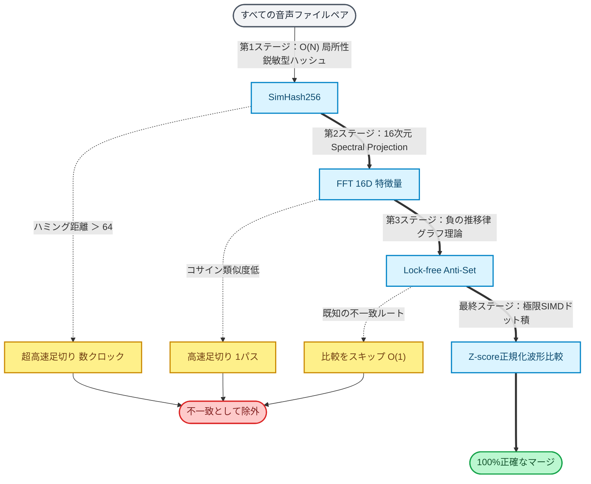

# BMS Part Tuner - 最適化実装ガイド

       

本ドキュメントは、BMS Part Tunerの最適化エンジンの実装詳細を解説する**技術者向け深掘りガイド**です。

本ドキュメントを最大限に活用するには、以下の前提知識があると便利です：

- 線形代数（ベクトル、内積、ノルム）
- 信号処理（サンプリング、RMS）
- .NET/C#（並列処理、メモリ管理）
- マルチスレッド設計パターン

---

## 最適化実装ガイドにおける変数定義の解説

### 1. 計算量理論に関する変数 (Complexity Analysis)

---

これらの変数は、主に「処理にどれくらいの時間がかかるか」を見積もるために使用されています。

- $n$ : 総対象数（行数、または総ファイル数）
    - 意味: 処理のベースとなるデータ量です。BMS解析やプリロードなど、全データを1回ずつ触る処理は $O(n)$ になります。
- $m$ : グループサイズ（特定のグループに含まれるファイル数）
    - 意味: ファイルサイズやRMS（音量）が似通った「比較対象候補」の数です。
    - なぜ重要か: 実装ガイドの $O(\sum{m^2})$ という表記は、グループ内でのペア比較（総当たり）を意味します。グループ化が上手く機能し m が小さくなれば、計算時間は劇的に短縮されます。
- $T$ : しきい値の試行回数 (Threshold count)
    - 意味: 0.01刻みなどでシミュレーションを行う際の、ループの回数です。
- $k$ : イテレーション（反復）のインデックス
    - 意味:総和計算における「反復変数」です。
    - $\sum_{k=1}^{T}$ のように「1番目のしきい値から $T$番目まで」を数え上げるためのカウンタ変数です。

### 2. 信号処理・統計学に関する変数 (Signal Processing)

---

音声波形の類似度を判定するための数式で使用されています。

- $r$ : ピアソン相関係数
    - 意味: 2つの波形がどれくらい似ているかを示す指標（$-1.0$ 〜 $1.0$）。$1.0$に近いほど「同じ音」と判定されます。
- $R^2$ : 決定係数
    - 意味: 回帰モデルの当てはまりの良さを示す指標。実装上は相関係数の二乗に近い意味合いで、判定精度を補強します。
- $x, y$ : 波形データ（信号ベクトル）
    - 意味: 比較する2つの音声データそのものを指します。
- $\hat{x}, \hat{y}$ : 正規化済み波形データ
    - 意味: 平均を0、ノルム（長さ）を1に調整したデータ。これにより、音量の大小に関わらず「波形の形」だけで比較可能になります。
- $RSS$ : 残差平方和
    - 意味: 2つの波形の「ズレ」の合計です。これが小さいほど、波形が一致していることを示します。
- $DSS$ : 偏差平方和
    - 意味: データ全体の「ばらつき」です。RSSをこれで割ることで、データの規模に左右されない相対的な誤差を算出します。

### 3. 組み合わせ論・基数変換に関する変数 (Combinatorics)

---

BMSの「定義枠（#WAV）」をどれだけ確保できるかを計算するために使用されます。

- $R$ : 基数
    - 意味: 数値の数え方の底。標準BMSは 36 通りの文字列(0-9, A-Z)、本ツールの拡張モードは 62 通りの文字列(0-9, A-Z, a-z) です。
- $L$ : 桁数
    - 意味: BMS定義番号の桁数（通常は 2 固定）。
- $C$ : 容量
    - 意味: 使用可能な最大定義数。$C = R^L - 1$ という式で、最大何種類の音を鳴らせるかが決まります。
- $i$ : 整数インデックス
    - 意味: 内部で管理している $0, 1, 2...$ という連番です。これを BaseConv 関数で `'01', '0A'` などのBMS用文字列に変換します。

## **クラス設計**

### **コアクラス**

#### **BmsOptimizationService**（サービス層のオーケストレータ）

**責務**: 全体のワークフローを制御・統合

#### **SimulationEngine**（しきい値探索の評価器）

**責務**: 複数のしきい値で「削減後ユニーク数」を推定し、しきい値探索に必要な系列データを作る。

- エントリポイント（実装）
    - `RunParallelSimulation(rangeMin, rangeMax, step, progress)`
        - しきい値リストを**降順**に生成し、しきい値ごとのシミュレーションを**順次**実行
        - Base36条件（1295件以下）を満たした時点で早期終了
        - しきい値ごとの内部（SimulateThreshold）では、グループ単位で `Parallel.ForEach` により並列化
    - `RunParallelSimulationDetailed(...)`
        - しきい値自体も `Parallel.ForEach` で並列化する別実装（サービス層では現状未使用）

- 計算量（概算）
    - しきい値数を $T$、グループサイズを $m$ とすると
        - しきい値探索: $O\left(\sum_{k=1}^{T}(n + \sum m^2)\right)$
    - 実装は「降順 + Base36成立で早期終了」するため、実運用では $T$ が小さくなる（=高速化）。

---

### **ファイル管理層**

#### **FileList**

**責務**: 1つのBMSファイルに対して、#WAV定義を解析し、WAVファイルのメタ情報リスト（`WavFiles`）を作成・保持する。

#### **BmsManager**

**責務**: BMSの行解析と、譜面データ内の定義番号置換のための低レベルユーティリティ。

#### **BmsFileRewriter**

**責務**: 置換テーブル（replaces）に基づき、#WAV定義と譜面データを整列・書き換えして出力する。

- 計算量の目安
    - BMS読み込み/書き換え: $O(n)$（行数）
    - 置換（譜面データ部）: $O(m)$（置換対象の譜面行数 × 文字列長に比例）

---

### **キャッシュ管理層**

#### **AudioCacheManager**

**責務**: 音声データのオンメモリ管理

- 職責
    - 音声ファイルの並列プリロード
    - バッチ処理による効率化
    - メモリ使用量の統計出力（推定）
    - 破損ファイル等の失敗を収集して呼び出し元へ返却

- 最適化戦略
    - バッチサイズ: $\max(10, \lfloor \frac{\text{totalFiles}}{\text{cores} \times D}\rfloor)$（$D$ は定数、実装は AppConstants.Cache.BatchSizeDivisor）
    - バッチ間: 並列（MaxDegreeOfParallelism = Environment.ProcessorCount）
    - バッチ内: 順次（ディスク負荷を抑え、シークを減らす）
    - 進捗レポート: バッチ単位

#### **CachedSoundData**

**責務**: 音声データのメモリ表現（POCO）

- 職責
    - 波形データの保持（オンメモリキャッシュ）
    - チャンネル分離（デインターリーブ）済みの配列を提供
    - RMS（TotalRms）と、Phase 2 用の正規化波形（NormalizedWaveform）を事前計算
    - 推定メモリ使用量を算出

- メモリ使用量の概算
    - 1秒の音声（44.1kHz, ステレオ）の場合
        - サンプル数: $44{,}100\,\text{samples/ch} \times 2\,\text{ch} = 88{,}200$
        - メモリ: $88{,}200 \times 4\,\text{bytes} \approx 352.8\,\text{KB}$
    - 30秒の音声の場合
        - $352.8\,\text{KB} \times 30 \approx 10.6\,\text{MB}$

---

### **グループ化層**

#### **AudioFileGroupingStrategy**

**責務**: 効率的なファイルグループ化による比較最適化

### **比較エンジン層**

#### **ParallelAudioComparisonEngine**

**責務**: マルチスレッド音声比較と4段階カスケード分類アルゴリズムのオーケストレーション

- 職責（実装ベース）
    - グループ単位での並列比較（Parallel.ForEach）
    - カスケードアルゴリズムによる早期足切り（Early Pruning）
    - 置換テーブル（int[]）の更新（CAS / Interlocked）

- 並列化とカスケード戦略
  比較対象のペアは、計算コストの低い手法から順に評価され、不一致と判断された時点で即座に次のペアへ移行します。
    1. **Stage 1 (Lock-free Anti-Set)**: 過去の比較で不一致だったペアをビットマスクでキャッシュし、$O(1)$ でスキップ。
    2. **Stage 2 (SimHash256)**: 波形から算出した256bitのLSH（局所性鋭敏型ハッシュ）のハミング距離を `POPCNT` で計算し、数クロックで足切り。
    3. **Stage 3 (FFT 16D Features)**: 高速フーリエ変換による16次元の周波数帯域ごとのエネルギー特徴量を使用し、ユークリッド距離で足切り。

#### **FastWaveCompare**

**責務**: カスケードの最終段（Stage 4）におけるSIMD最適化された厳密な一致判定

- 判定対象（実装）
    - ピアソン相関係数 $r$（$-1.0 \le r \le 1.0$）を用いた Z-score 正規化波形比較。
    - Stage 3までを通過した（＝極めて類似性が高いと推測される）ペアに対してのみ実行されます。

- IsMatch(data1, data2, threshold) の処理フロー
    1. フォーマット一致チェック（SampleRate / Channels 等）
    2. 長さ一致チェック（TotalSamples）
    3. 正規化波形のドット積によるピアソン相関係数の計算（SIMDベクタライズ）
    4. $\text{correlation} \ge \text{threshold}$ なら一致と判定

数式（Phase 2: 正規化波形がある場合）:
正規化済み波形 $\hat{x}, \hat{y}$ に対して
$$ r = \sum\_{i=1}^{n} \hat{x}\_i \hat{y}\_i $$

#### **WaveValidation**

**責務**: 波形指標の計算（SIMD最適化）

- 提供API（実装）
    - CalculatePearsonCorrelationSIMD(wav1, wav2)
        - 1パスで $\sum x$, $\sum y$, $\sum x^2$, $\sum y^2$, $\sum xy$ を計算し、平均・分散・共分散からピアソン相関係数 $r$ を算出
        - 定数列（分散ほぼ0）や短配列の特例を持ち、結果は $[-1, 1]$ にクランプ

    - CalculatePearsonFromNormalizedSIMD(normalizedWav1, normalizedWav2)
        - 正規化済み（平均0・ノルム1）前提で、ドット積で $r$ を算出

    - CalculateRSquaredSIMD(wav1, wav2)
        - 決定係数 $R^2$ を算出（FastWaveCompare は現状これを使用していない）

数式:
$$ r = \sum*{i=1}^{n} \hat{x}\_i \hat{y}\_i $$
$$ R^2 = 1 - \frac{RSS}{DSS} $$
$$ RSS = \sum*{i=1}^{n}(x*i - y_i)^2 $$
$$ DSS = \sum*{i=1}^{n}(x_i - \bar{x})^2 $$

備考:

- SIMD は Vector<float> を使用（実行環境に応じてベクトル幅が変化）
- 相関は 0〜1 を主に想定するが、逆相なら -1 になり得る

---

## **データフロー**

### **メイン処理フロー**

```mermaid
flowchart TD
    %% スタイル定義（意味論的カラーリング）
    classDef startNode fill:#f3f4f6,stroke:#4b5563,stroke-width:2px,color:#1f2937;
    classDef processNode fill:#dbf4ff,stroke:#0284c7,stroke-width:2px,color:#0c4a6e;
    classDef filterNode fill:#fef08a,stroke:#ca8a04,stroke-width:2px,color:#713f12;
    classDef successNode fill:#bbf7d0,stroke:#16a34a,stroke-width:2px,color:#14532d;
    classDef rejectNode fill:#fecaca,stroke:#dc2626,stroke-width:2px,color:#7f1d1d;

    %% 起点
    Start(["すべての音声ファイルペア"]):::startNode

    %% メインパイプライン（成功ルート：ブルー）
    Start -->|"第1ステージ：O(N) 局所性鋭敏型ハッシュ"| S1["SimHash256"]:::processNode
    S1 ==>|"第2ステージ：16次元 Spectral Projection"| S2["FFT 16D 特徴量"]:::processNode
    S2 ==>|"第3ステージ：負の推移律 グラフ理論"| S3["Lock-free Anti-Set"]:::processNode
    S3 ==>|"最終ステージ：極限SIMDドット積"| S4["Z-score正規化波形比較"]:::processNode
    S4 ===> Success(["100%正確なマージ"]):::successNode

    %% 足切りルート（除外判定：イエロー）
    S1 -.->|"ハミング距離 ＞ 64"| R1["超高速足切り 数クロック"]:::filterNode
    S2 -.->|"コサイン類似度低"| R2["高速足切り 1パス"]:::filterNode
    S3 -.->|"既知の不一致ルート"| R3["比較をスキップ O(1)"]:::filterNode

    %% 足切りの収束先（破棄ルート：レッド）
    R1 --> Reject(["不一致として除外"]):::rejectNode
    R2 --> Reject
    R3 --> Reject
```

## **パフォーマンス特性**

### **時間計算量（詳細分析）**

| フェーズ   | 計算量        | 時間   | 備考                               |
| ---------- | ------------- | ------ | ---------------------------------- |
| BMS解析    | $O(n)$        | 10ms   | 行数に比例（テキスト処理）         |
| プリロード | $O(n)$        | 1-5s   | バッチ並列・Memory-Mapped FilesによるゼロコピーI/O |
| グループ化 | $O(n)$        | 50ms   | メモリ操作のみ                     |
| 比較処理   | 近似 $O(n)$   | ~300ms | 4段階カスケード分類による劇的な早期除外 |
| BMS置換    | $O(n)$        | 10ms   | テキスト置換                       |
| 合計       | -             | 1-5s   | 主にファイルI/Oに依存（比較自体は一瞬） |

### **しきい値探索（シミュレーション）の時間特性**

`FindOptimalThresholdsAsync` は「キャッシュ → しきい値ごとのユニーク数推定」を行います。

- しきい値探索の支配項（概算）
    - しきい値数を $T$（例: 0.00..1.00 step 0.01 なら最大101）として
        - $O\left(T \times (n + \sum m^2)\right)$
- 実装上のポイント
    - `RunParallelSimulation` はしきい値を降順に**順次**評価し、Base36条件成立で早期終了するため、実運用では $T$ が小さくなりやすい
    - 各しきい値の内部ではグループ単位で並列化される（CPUバウンド寄り）

**計算量の詳細（概算の考え方）**:

- **$O(n)$操作**: 各ファイルを1回走査
    - BMS解析: $\text{定数} \times \text{行数}$
    - プリロード: ファイルI/O（ストレージ性能に依存）
- **近似 $O(n)$操作**: カスケード分類による比較
    - LSHやFFTを用いた早期除外により、計算量の高い波形比較を行うペアを極限まで削減
    - 実際の比較計算負荷は、SIMDベクタライズと定数時間キャッシュ（Anti-Set）により劇的に抑制

### **空間計算量（メモリ使用量）**

| データ構造        | メモリ使用量                                                | 備考                         |
| ----------------- | ----------------------------------------------------------- | ---------------------------- |
| WavFiles[]        | $O(n)$                                                      | ファイル定義リスト           |
| CachedSoundData[] | $O(n)$                                                      | 音声サンプルデータ           |
| グループリスト    | $O(n)$                                                      | インデックスの参照           |
| 置換テーブル      | $\approx 3844 \times 4\,\text{bytes} \approx 15\,\text{KB}$ | int配列（Union-Find）        |
| **合計**          | **~440MB** (例)                                             | $2196 \times 200\,\text{KB}$ |

**メモリ最適化テクニック**:

1. **遅延ロード**: ファイルメタデータのみ先読み
2. **バッチ処理**: 全体をメモリに載せず分割処理
3. **参照型管理**: キャッシュデータは参照管理（GC対応）
4. **早期リリース**: グループ比較完了後にデータ解放

---

## **関連ドキュメント**

本ドキュメントはドキュメント階層の最下層です。関連リソースへのリンク：

**上位ドキュメント（参照先）**:

- [README.md](../README.md) - プロジェクト概要・ユーザーガイド
- [TECHNICAL_GUIDE.md](TECHNICAL_GUIDE.md) - 技術的背景・アルゴリズム解説

**プロジェクト内ドキュメント**:

- [ARCHITECTURE.md](ARCHITECTURE.md)
  システム全体のコンポーネント構成とクラス設計の概要
- [TEST_DESIGN.md](TEST_DESIGN.md)
  ユニットテストおよびミューテーションテストの設計方針
- [COMMIT_MESSAGE_GUIDE.md](COMMIT_MESSAGE_GUIDE.md)
  開発に参加する際のコミット規約

**標準化規格**:

- [bmson仕様](https://bmson-spec.github.io/) - JSON形式のBMS
