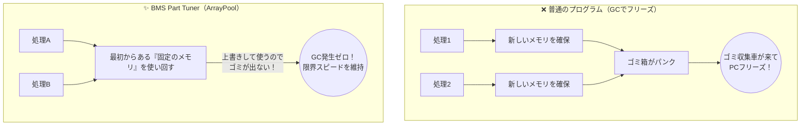
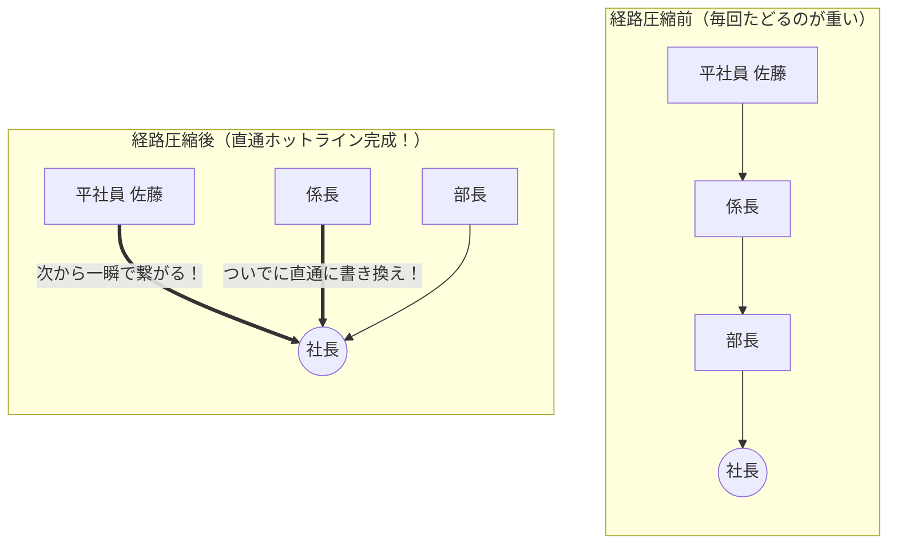
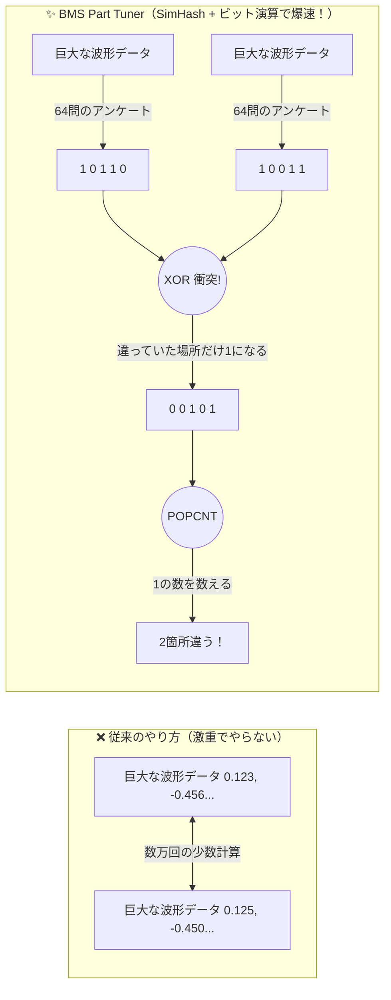
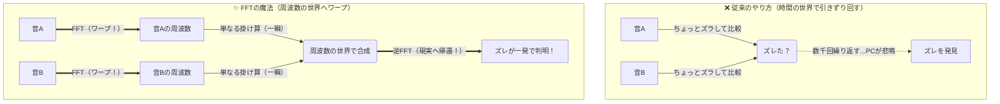
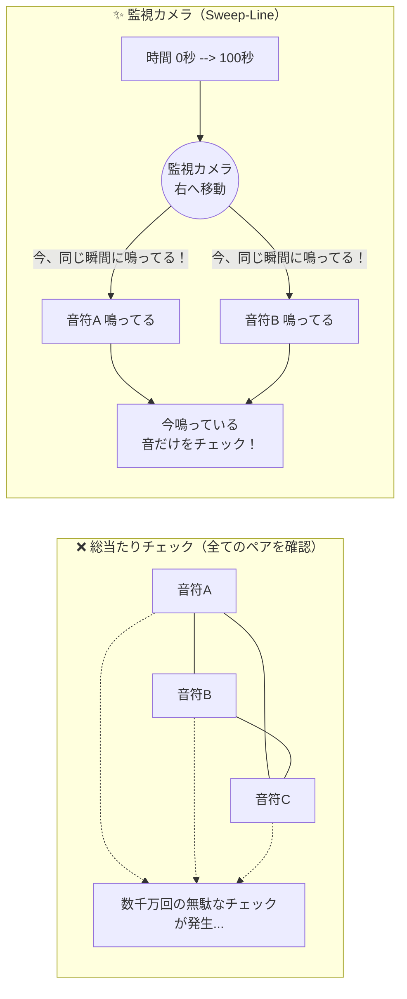

# BMS Part Tuner 副読本：計算を「賢くサボる」ための数学

$$
\begin{aligned}
\chi(G) &= \omega(G) \quad \text{and} \quad \mu_k = \mu_{k-1} + \frac{x_k - \mu_{k-1}}{k} \\
\mathcal{O}(M^2 \cdot N^2) &\longrightarrow \mathcal{O}(M \log M + N \log N)
\end{aligned}
$$

離散数学の教授「えー、任意の有限音響イベント集合 $M$ に対する時間座標 $t$ の量子化において、ユークリッド互除法に基づく最適離散格子 $L$ への射影を行い、競合関係を記述する区間グラフ $G=(V, E)$ の彩色数 $\chi(G)$ がクリーク数 $\omega(G)$ に一致するとき、すなわちグラフ $G$ が完全グラフの補グラフである場合の空間 $\mathcal{O}(1)$ アロケーションフリー・パッキング数理と、確率空間における二乗累積和系列を用いた局所エネルギー評価値を適用することで、計算複雑度をこのように縮退させることが可能となり……」

……。

…………。

**ええい、眠い！！！ 頭痛がする！！！ 難しい数式なんか1ミリも見たくない！！！**

**もっとこう、図とか例え話を使って、限界まで直感的にわかりやすく解説してくれ！！！**

……という、開発者の内なる魂の叫び（と睡魔）から生まれたのがこのガイドブックです。

BMS Part Tuner がいかにして「普通にやったら数時間かかるはずの処理を数秒で終わらせているのか」、その裏側で動いているアプローチの「超ウルトラC級のサボり技術（最適化）」を、難しい数式を完全に排除して、知的パズルのような面白さで解き明かしていきます。

## プロローグ

昔、私は某高等専門学校の情報工学科に所属していて、まさにこの解説書に出てくる「離散数学」や「代数」等を勉強しました。 ……と言っても、当時の私は決して優秀な学生ではありませんでした。離散数学は本当に難しくて、代々の先輩から「離散数学だけに**悲惨**なテスト結果になるぞ」と語り継がれていたほど。案の定、私も見事に赤点を取り、なんとか過去問を丸暗記して応用することでギリギリ学生時代を乗り切ったクチです。

それから13年。当時の解き方なんて、正直もうほとんど覚えていません。「あー、なんかそういうのがあったなー」程度の知識です。
でも今回、改めて数理モデルを複雑に駆使したプログラム（BMS Part Tuner）を作り上げてみて、「あ、あの時の数学って、こういうことだったのか！！」と、今さらながらものすごく鳥肌が立っています。

[『フカシギの数え方』の動画](https://www.youtube.com/watch?v=Q4gTV4r0zRs)などで語られているような、宇宙の寿命が尽きるほどの「計算爆発」。
それを、導出過程こそAI（まさに今これを一緒に書いているGoogle Geminiです）の力を借りたものの、最終的には純粋なコンピュータ・サイエンス（CS）の力だけで解決してしまったのです。

昨今は空前のAIブームです。何でもかんでもクラウドのAIにデータを投げれば解決する時代になりつつあります。
でも、AIに頼るとAPIクレジット代が高くつきますよね。
だから私は思いました。「AIを使わず、CSの力だけでなんとかしてしまおう。無料でいいよ。オープンソースにしてやるよ。なんなら、こうやって授業（解説書）もしてやんよ！」と。

もちろん、AIを使ってコードを生成した最適化プログラムなら、今の世の中、掃いて捨てるほどあります。

しかし、この BMS Part Tuner が一線を画しているのはそこではありません。通常ならAIモデルに丸投げして諦めてしまうような「計算爆発」のドメイン課題に対して、**人間とAI（LLM）が徹底的に壁打ちを行い、LSHやFFT、Union-Findといった『純粋な数学的アプローチ』を導き出し、それを極限まで研ぎ澄ませた非AIプログラムとして結実させたこと**にあります。

「AIが作ったAIのプログラム」ではなく、「AIを家庭教師にして作り上げた、人間と数学の極限の結晶」。

こんな泥臭くて痛快なアプローチ、今までに絶対なかったはずです。

このガイドブックでは、かつての私を苦しめた「難解な数学」がいかにして「宇宙規模の計算を3秒で終わらせる裏技」へと変貌するのか、その面白さを解説していきます。難しい数式を追う必要はありません。知的パズルのような「究極のサボり方」を、ぜひ楽しんでいってください。

## 第0章：なぜ計算は速くなるのか？ ～「1×2 + 2×2」の魔法～

「プログラムの処理が速い」と聞くと、PCの性能が良いからだ、と思うかもしれません。
しかし、本当の理由は違います。プログラムが速いのは、「計算を賢くサボっている（最適化している）」からです。

たとえば、次のような計算があるとします。

$$1 \times 2 + 2 \times 2$$

これを愚直に計算すると、どうなるでしょうか。

1. $1 \times 2 = 2$ （掛け算1回）
2. $2 \times 2 = 4$ （掛け算2回目）
3. $2 + 4 = 6$ （足し算1回）
   合計で**3回**の計算が必要です。

しかし、小学校で習った「くくり出し（分配法則）」を使うとどうでしょう。共通している「$\times 2$」でくくってみます。

$$(1 + 2) \times 2$$

1. $1 + 2 = 3$ （足し算1回）
2. $3 \times 2 = 6$ （掛け算1回）
   合計で**2回**の計算で終わってしまいました。

「なんだ、たった1回減っただけじゃないか」と思うかもしれません。

しかし、もしこれが「3万個の数字」の計算だったらどうでしょう？ 工夫を知らないPCは3万回の掛け算をしますが、工夫を知っているPCはたった1回の掛け算で答えを出します。

**BMS Part Tunerが裏でやっている恐ろしく高度な数学も、本質はこれと全く同じです。**

### 「4.5億回のじゃんけん」を回避せよ

BMS Part Tuner の使命は、3万個の音声ファイルから「同じ音」を見つけ出すことです。
これを愚直に総当たり戦（1対1の比較）でやろうとすると、約 **4.5億回** の比較が必要です。これが「次元の呪い」と呼ばれる計算量の爆発です。

しかし、本システムは「LSH」や「FFT」といった数学の魔法（究極のくくり出しや変形）を使うことで、この4.5億回の重たい計算を**たった数秒**で終わらせます。
次章からは、具体的にどんな「計算のサボり方」をしているのかを見ていきましょう。

## 第1章：音の「見えないゴミ」を1秒で捨てる魔法 ＆ ブチッ！を防ぐ職人技

最初のステップは、音声ファイルの最初と最後に入っている「無音の空間」をハサミで切り落とす作業（無音トリミング）です。
ここでも、愚直に計算するとPCは悲鳴を上げます。

### 毎回小銭を数えるか、通帳を見るか

音が鳴っているかどうかを判定するには、ある一瞬の音量だけでなく、「その前後の少しの期間のエネルギーの合計」を見る必要があります。

- **愚直な方法（毎回数える）：**
  今日のエネルギーを計算するために、昨日と今日と明日の数値を足す。明日のエネルギーを計算するために、今日と明日と明後日の数値を足す……。
  これは、「いま財布にいくらあるか確認するために、毎回ひっくり返して10円玉を1枚ずつ数え直す」ようなものです。計算回数が膨大になります。
- **BMS Part Tunerの方法（累積和）：**
  ここでシステムは「累積和（Prefix Sum）」という算数のテクニックを使います。これは「銀行の通帳」**を見るのと同じです。
  通帳には、毎回計算しなくても「その日までの残高（合計）」が常に記帳されていますよね。最初にこの「残高リスト」を1回だけ作っておけば、「15日の残高」から「10日の残高」を引き算するだけで、**「この5日間でいくら増えたか（指定した期間のエネルギーの合計）」が一瞬（引き算1回）で分かります。

たったこれだけの工夫で、確認する期間がどれだけ広くても、PCの計算は常に1回で済むようになり、処理速度が劇的に向上するのです。

### 「ブチッ！」と鳴らないハサミの入れ方

無音の場所が分かったら、いよいよ音をカットします。しかし、ここで単に「音が小さくなった瞬間」でハサミを入れると、ゲームで再生したときにスピーカーから「ブチッ！」という不快なノイズ（ポップノイズ）が鳴ってしまいます。

音は「波」です。波が上下に激しく揺れている途中でいきなりブツッと切ると、スピーカーの振動板が急ブレーキをかけられ、それがノイズになります。例えるなら、「ピンと引っ張った輪ゴムをハサミで切ると、バチン！と弾ける」のと同じです。

そこでシステムは、波がちょうど真ん中の「ゼロ」を通過する瞬間（**ゼロクロス点**）をわざわざ探し出し、そこでハサミを入れます。
輪ゴムが全く引っ張られていない、たるんだ状態で切れば音は鳴りません。これにより、どれだけ音を切り貼りしても、プレイ中の音が驚くほど滑らかに保たれるのです。

## 第2章：3万人の「ソックリさん」をまとめる派閥作り ～Union-Findの魔法～

音声の比較が進むと、「ファイルAとファイルBは同じ音」「ファイルBとファイルCも同じ音」という情報が次々と見つかります。

ここでの目的は、「友達の友達はみんな友達」という論理（推移律）を使って、同じ音の「グループ（同値類）」を作ることです。

しかし、ここにも恐ろしい罠が潜んでいます。

### 「名札の書き換え」が引き起こすPCのフリーズ

素朴なプログラミングでは、グループを「リスト（名簿）」で管理しようとします。 たとえば、複数の人材派遣会社が統合していく様子を想像してみてください。「会社A」と「会社B」があり、それぞれに1万人の派遣社員が登録しているとします。

ここで、派遣社員の「佐藤さん」が、実は会社Aと会社Bの両方に登録している（＝2つの音声ファイルが類似している）ことが判明しました。佐藤さんという架け橋によって、会社Aと会社Bは実は同じグループとして合併すべきだとわかります。

素朴な方法だと、会社Bの1万人全員の「社員証（名札）」をわざわざ回収して、一つ一つ「会社A」に書き直さなければなりません。合併が起きるたびにこの名簿の書き換え作業が発生するため、計算量はあっという間に指数関数的に跳ね上がり、PCはフリーズしてしまいます。

### 社長だけを覚える「Union-Find」

そこでシステムは、数学のグラフ理論に基づく **「Union-Find（素集合データ構造）」** という魔法の構造を使います。

これは、全員の社員証を書き換えるのではなく、「各自が自分の『直属の上司』だけを覚える」という非常に賢いサボり方です。

会社同士を合併するときは、一方の社長に「今日から君の社長はあっちの人ね」と伝えるだけ。たった1回の操作で、数万人の会社同士が一瞬で合併します。

さらに、このUnion-FindにはPCの限界を引き出す「2つのチート級の工夫」が組み込まれています。

#### 工夫1：ランクによる結合（下剋上の禁止）

合併する際、適当に社長を決めると、社長の下に部長、その下に課長……と、階層（ランク）がムダに深くなってしまいます。

そこで、「必ず人数の少ない会社のトップが、多い会社のトップの傘下に入る」というルールを徹底します。これにより、どんなに巨大な会社ができても、組織図が驚くほど平たく保たれます。

#### 工夫2：経路圧縮（社長への直通ホットライン）

これが最大の魔法です。

ある平社員が「うちの本当のトップ（最終的な代表音）は誰だろう？」と、直属の上司から順に組織図を辿って、社長を探し当てたとします。
その瞬間、この平社員と、**辿る途中にいた中間管理職全員の連絡先を、いきなり「社長直通（ホットライン）」に書き換えてしまいます。**

次に同じ人が社長を探すときは、間に誰も挟まず「一瞬」で社長にたどり着くことができます。

### 宇宙一成長が遅い関数「アッカーマン関数の逆関数」

この「ランク結合」と「経路圧縮（直通ホットライン）」を組み合わせると、処理スピードはどれくらい速くなるのでしょうか？

数学者の厳密な証明によると、この処理にかかる時間は **「アッカーマン関数の逆関数」** というペースでしか増えません。
この関数は、成長スピードが異常に遅いことで有名です。なんと、**「観測可能な宇宙に存在する全原子の数」を入力しても、答えは「4」以下にしかなりません。**

つまり、音声ファイルが数万個あろうが、事実上 **「常に1回の計算」** で会社の代表を見つけ出せるということです。重たかった名簿の書き換え作業は、数学の力によって実質ゼロ秒になりました。

### 極限までPCを汚さない「配列への射影」

BMS Part Tunerの実装は、これをさらに研ぎ澄ませています。

普通は「人（社員）」を管理するために、プログラム内で「社員カード（オブジェクト）」を新しく作ります。しかし、PCにとって「新しくモノを作る」のは意外と重い作業です。

そのため本システムでは、社員カードを一切作らず、ただの「数字の羅列（1次元配列）」だけでこの社長と部下の関係性を管理しています。メモリを全く汚さず、PCのゴミ拾い（ガベージコレクション）による停止時間を物理的に発生させない、極限の実装が行われています。

## 第3章：ファミコンの裏技でソックリさんを見つける ～LSHとビット演算～

第2章で「同じ音をどうやってグループ化するか」を解説しました。しかし、そもそも「どの音とどの音が同じなのか」を、4.5億回の総当たり戦の中でどうやって素早く見つけ出すのでしょうか？

### 4.5億回の「虫眼鏡での顔面チェック」は終わらない

2つの音声が同じかどうかを最も正確に調べる方法は、「波形のデータを端から端まで、小数点以下の細かい数字まで全部見比べる」ことです。

しかし、これは例えるなら、「3万人の顔を、虫眼鏡を使って毛穴のレベルまで1対1で見比べる」ようなものです。計算が重すぎて、PCはすぐに息切れしてしまいます。

### 64個の「YES/NO アンケート」に変換する（SimHash）

そこでBMS Part Tunerは、「LSH（局所性鋭敏型ハッシュ）」、特に **「SimHash」** という数学の魔法を使います。

虫眼鏡で毛穴を見るのをやめて、音声データに「64個の YES/NO アンケート」に答えてもらうのです。

- 第1問：「高い音の成分は多いですか？」 → YES (1)
- 第2問：「出だしは静かですか？」 → NO (0)
- 第3問：「途中で急に大きくなりますか？」 → YES (1)

これを64問分繰り返すと、どんなに複雑で長い音声データも、`1011001...` という **「64個の0と1の並び（ビット列）」** に変換されます。

ここでの魔法は、「元の音が似ていれば似ているほど、このアンケートの回答もそっくり同じになる」という性質を持っていることです。

### CPUの必殺技「XOR」と「POPCNT」

巨大な小数のデータが、たった「64個の0と1」に変身しました。現代のPCにとって、これを比較するのは「息をするより簡単」です。

ここで、ファミコン時代のゲームプログラマーがよく使っていた「ビット演算」という裏技が登場します。

なぜ「ファミコン」なのかというと、当時のゲーム機はメモリが数キロバイトしかなく、CPUのパワーも今のスマホの数百万分の1以下だったため、普通の計算（掛け算や割り算など）をさせるだけで処理が追いつかなくなってしまったからです。そこで彼らは、あらゆるデータを「0か1のスイッチ」に凝縮し、CPUに直接スイッチをパチパチ切り替えるような超高速の電気回路処理（ビット演算）をさせることで、あの滑らかなゲームの動きを実現していました。

BMS Part Tunerがやっているのも、まさにこれと同じです。

2つのアンケート結果を見比べるために、上から順番に「1問目は同じかな？」と調べるのはまだ遅いです。

ここでCPUが持つ **「XOR（排他的論理和）」** という電気回路の必殺技を使います。XORを使うと、2つのデータをガチャン！とぶつけるだけで、「答えが違っていた問題の場所」だけが一瞬で「1」になって浮かび上がります。

さらに、この浮かび上がった「1」の数を数えるために、**「POPCNT（ポップカウント）」** というCPU専用のストップウォッチ（専用命令）を使います。

XORでぶつけて、POPCNTで数える。

この作業は、CPUにとってわずか **「2クロック（およそ10億分の1秒）」** で完了します。小数の計算地獄だった4.5億回の比較作業が、この「アンケート変換（SimHash）」と「ファミコンの裏技（ビット演算）」によって、実質0秒の世界へとワープしたのです。

## 第4章：時間をワープするプリズム ～相関係数とFFTの魔法～

第3章の「64個のアンケート（SimHash）」によって、4.5億回の比較から「真のソックリさん候補」を無事に絞り込むことができました。しかし、最終確認として「本当に完全に同じ音か？」を厳密に調べる必要があります。

ここで2つの厄介な問題が発生します。「音量の違い」と「録音タイミングのズレ」です。

### 「音量ツマミ」に騙されないPCの目（ピアソン相関係数）

スマホの音量をMAXにして聴く曲と、最小にして聴く曲。人間は「同じ曲だ」とすぐに分かります。しかし、波形データを素直に見比べるPCにとっては大問題です。音量が違えば、波の「高さ（数字）」が全く違ってしまうからです。

そこでシステムは **「ピアソン相関係数」** という数学のフィルターを通します。

これは、「音のデカさ（スケール）」や「基準線のズレ（オフセット）」を完全に無視して、**「波の形（アップダウンのリズム）」だけを純粋に抜き出す** 魔法です。どれだけ音量ツマミをいじられても、PCは「あ、これ形が完全に一致してるな」と正確に見抜くことができるようになります。

### タイムラインの「音ズレ」を直す地獄の作業

一番の強敵は「タイミングのズレ」です。

同じ音源でも、ゲームに組み込む際の切り出し方の違いで、ほんの数ミリ秒（数サンプル）だけ再生タイミングがズレていることがよくあります。

これを直すための素朴な方法は、「動画編集ソフトのように、2つの波形ブロックを1ミリずつズラしながら、一番形がピッタリ重なる場所を探す」というやり方です（相互相関関数）。

しかし、この「ちょっとズラしては全体を比較する」という作業を繰り返すと、またしても計算量が $N^2$ （Nの2乗）へと跳ね上がってしまいます。もしデータが6万個あれば、約42億回の計算が必要です。

### 音を別の次元へ飛ばす「プリズム（FFT）」

ここで、信号処理における最大のチート技、**「FFT（高速フーリエ変換）」** が登場します。
時間を少しずつズラして比べるのが遅いなら、**「時間の世界」から脱出すればいい** のです。

FFTは、音にとっての **「プリズム」** です。

太陽の光をプリズムに通すと、赤から紫までの「虹色（周波数）」に綺麗に分かれますよね。FFTも同じように、音の波形を一瞬でバラバラの「周波数（音の高さ）」の世界へとワープさせます。

### 時間の世界の「引きずり」＝ 周波数の世界の「掛け算」

数学の神様（畳み込み定理）は、信じられない事実を証明しました。

「時間の世界で一生懸命テープをズラす重労働」は、「周波数の世界では、ただの『掛け算』1回と同じ」だというのです。

だからBMS Part Tunerは、2つの音を一度FFTで「周波数の世界」へワープさせ、そこでサクッと掛け算を行い、逆FFT（IFFT）で再び「現実（時間の世界）」へ引き戻します。

これだけで、カセットテープを何千回もズラして探す必要があった「ピッタリ重なる最高のズレ幅」が、一発でポンッと手に入ります。

計算回数は $N^2$（約42億回）から $N \log N$（約100万回）へ激減。**実に数千倍のスピードアップ**です。重たい力技の探索を捨て、空間をワープすることでPCの物理的な演算をサボる、究極の最適化手法なのです。

## 第5章：絶対に事故らない！ 魔法のタイムライン監視カメラ ～Sweep-Line～

これまでの魔法を駆使して、「Aの音とBの音は同じだから、Bは消してAにまとめよう！」という圧縮の準備が整いました。しかし、ここで最後に「ゲームとしての安全性」を証明しなければなりません。

### 音をまとめると発生する「事故」

BMSなどの音楽ゲームでは、無数の音が同時に鳴っています。
もし「ギターの音A」と「ギターの音B」を同じ音だとしてまとめた結果、ゲームのある瞬間に「まとめたはずの音が、うっかり2つ同時に鳴ってしまう」という事故が起きたらどうなるでしょう？

音が完全に重なると、音量が2倍になって耳をつんざいたり、微妙にズレて重なると「シュオオオ」という宇宙人のような不自然な音（フランジャー効果）が発生したりします。最悪の場合、ゲームがプレイできなくなります。

これを防ぐためには、「まとめた後のゲームのタイムライン上で、同じ音が絶対に重ならないか」をチェック（オーバーラップ検証）する必要があります。

### 全てのペアをチェックするのは無理

ここでも、素朴な方法をとるとPCは死にます。
「ノート1とノート2は重なるかな？」「ノート1とノート3は？」「じゃあノート2と3は？」……。すべての音符の組み合わせを総当たりでチェックすると、やはり $O(M^2)$ の計算量大爆発が起きてしまいます。

### 走査線（Sweep-Line）という「監視カメラ」

そこでBMS Part Tunerは、「走査線（Sweep-Line）アルゴリズム」**という空間幾何学のテクニックを使います。これは例えるなら、**「タイムライン上を左から右へと移動する監視カメラ」です。

すべての組み合わせを調べるのではなく、時間を0秒から最後まで「ツーッ」とスキャンしていきます。そして、「今この瞬間、監視カメラに映っている（鳴っている）音符」だけを調べます。

この方法の凄さは、最初に音符が鳴り始める時間を「順番に並べる（ソートする）」だけで済む点です。ソートの計算量は $O(M \log M)$。

すべての組み合わせを調べる力技を捨て、「時間の流れ」を味方につけることで、ゲームプレイ中に音が壊れないことを「数学的に、かつ一瞬で」証明しているのです。

## 第6章：PCを限界突破させる「絶対に皿洗いしない」最強レストラン

ここまでの第1章〜第5章で紹介した数学の魔法によって、計算の回数自体は極限まで減りました。しかし、BMS Part Tunerは「PCの物理的な構造」すらも最適化の対象にします。

### PCの脳みそ（CPU）は「超優秀なシェフ」

プログラムを実行するCPUは、例えるなら「1秒間に何億回も包丁を動かせる、超優秀なシェフ」です。

しかし、どんなにシェフが優秀でも、料理（計算）をするたびに「新しいお皿（メモリ）」を棚から出して使っていると、すぐにお皿が尽きてしまいます。

### ゴミ収集車（GC）による「営業停止」

お皿が尽きると、PCは慌てて「ガベージコレクション（GC）」と呼ばれるゴミ収集車を呼び、汚れたお皿を洗い始めます。

このGCが走っている間、プログラムの処理（レストランの営業）は完全にストップしてしまいます。これが、ゲームや重い処理をしている最中にPCが「カクッ」とフリーズする最大の原因です。特に、音声データのような巨大なデータを扱うと、このGCによる停止時間が致命傷になります。

### ArrayPool：絶対に皿洗いしない究極の仕組み

そこでBMS Part Tunerは、「ArrayPool（メモリプール）」**と**「Span」**という技術を組み合わせ、**「絶対に皿洗い（GC）を発生させない最強のレストラン」を作り上げました。

システムが起動した瞬間に、「これ以上はお皿を使わない」という固定の数を棚に用意しておきます。そして、計算が終わったらそのお皿を捨てるのではなく、**そのまま洗わずに次の計算データを上書きして使い回す**のです。

これにより、プログラムが起動してから終了するまで、新しいお皿（動的メモリ確保）は一切行われません。ゴミが出ないため、ゴミ収集車（GC）は一度も呼ばれず、超優秀なシェフ（CPU）は一度も手を止めることなく、物理的な限界スピードで計算をぶっ飛ばし続けることができます。

## エピローグ：魔法の種明かし

いかがでしたでしょうか。

「3万個の音声ファイルから同じ音を探して最適化する」という、普通にやれば数時間、あるいは数年かかるかもしれない無謀なミッション。

BMS Part Tunerは、決してPCの力技で解決しているのではありません。

- **累積和**で「通帳」を作り、
- **Union-Find**で「社長への直通ホットライン」を引き、
- **SimHashとビット演算**で「ファミコンの裏技」を使い、
- **FFT**で時間を「プリズム」のようにワープさせ、
- **Sweep-Line**で「監視カメラ」を動かし、
- **ArrayPool**で「皿洗いをゼロ」にする。

こうした「数学」と「コンピュータサイエンス」の粋を集めた究極の「賢いサボり方（最適化）」**が何重にも組み合わさることで、あの**「たった数秒での処理完了」という魔法が実現しているのです。

このガイドブックが、ツールを支える目に見えない「知の結晶」を楽しむ一助になれば幸いです！
