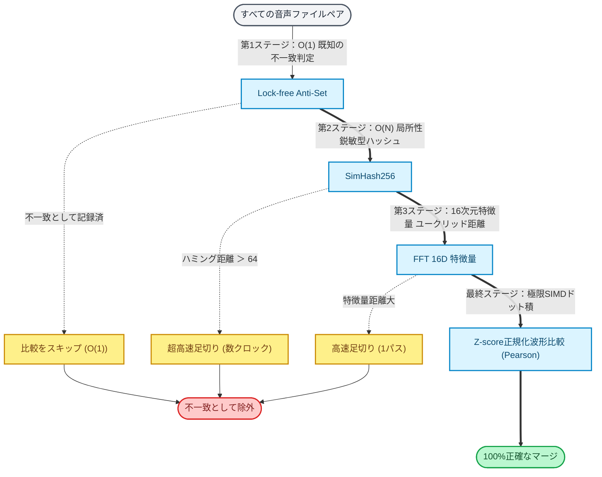

# BMS Part Tuner: 技術ドキュメント

**BMS Part Tuner** の開発者向け・技術ドキュメントサイトへようこそ。
このサイトでは、アプリケーションを支えるアーキテクチャ、数理モデル、そして極限の最適化技術について深く掘り下げています。

## "8000倍"の最適化カスケード

BMS Part Tunerは、従来の $O(N^2)$ の総当たり比較を排除し、純粋な計算機科学と数理論理学に基づくカスケードアルゴリズムによって極限のパフォーマンスを実現しています。

## ナビゲーション

左側のサイドバー、または以下のリンクから各種技術ドキュメントをご覧ください。

* **[アーキテクチャ概要](00_ARCHITECTURE_JP.md)** - システム全体の設計思想
* **[テクニカルガイド](01_TECHNICAL_GUIDE_JP.md)** - 最適化アルゴリズムの詳細と数理モデル
* **[パフォーマンス最適化](02_OPTIMIZATION_GUIDE_JP.md)** - 「8000倍」の高速化をもたらした実装手法
* **[bmson変換システム](05_BMSON_CONVERSION_JP.md)** - メモリ最適化とキャッシュによる高速ダウンコンバート
* **[テスト設計](03_TEST_DESIGN_JP.md)** / **[コミット規約](COMMIT_MESSAGE_GUIDE_JP.md)** - 開発・品質保証プロセス

_(Note: ヘッダーの言語スイッチャーから英語版（English）のドキュメントに切り替えることも可能です)_

