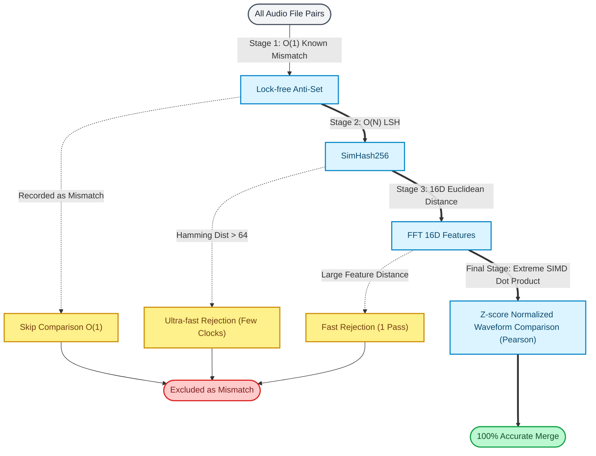

# BMS Part Tuner: Technical Documentation

Welcome to the technical documentation site for **BMS Part Tuner**. 
This site contains deep dives into the architecture, mathematical models, and extreme optimizations that power the application.

## The "8000x" Optimization Cascade

BMS Part Tuner achieves its extreme performance by eliminating the standard $O(N^2)$ brute-force comparisons and replacing them with a highly optimized cascade of algorithms powered by pure computer science and mathematical logic.

## Navigation

Please explore the various technical documents using the left sidebar or the links below:

* **[Architecture](00_ARCHITECTURE_EN.md)** - Overall system design and patterns
* **[Technical Guide](01_TECHNICAL_GUIDE_EN.md)** - Details of the optimization algorithms and mathematical models
* **[Optimization Guide](02_OPTIMIZATION_GUIDE_EN.md)** - Implementation techniques behind the "8000x" speedup
* **[Bmson Down-conversion](05_BMSON_CONVERSION_EN.md)** - High-speed down-conversion via memory optimization and caching
* **[Test Strategy](04_TEST_STRATEGY_EN.md)** / **[Commit Guide](COMMIT_MESSAGE_GUIDE_EN.md)** - Development and QA processes

_(Note: You can switch to the Japanese documentation using the language switcher in the header.)_
