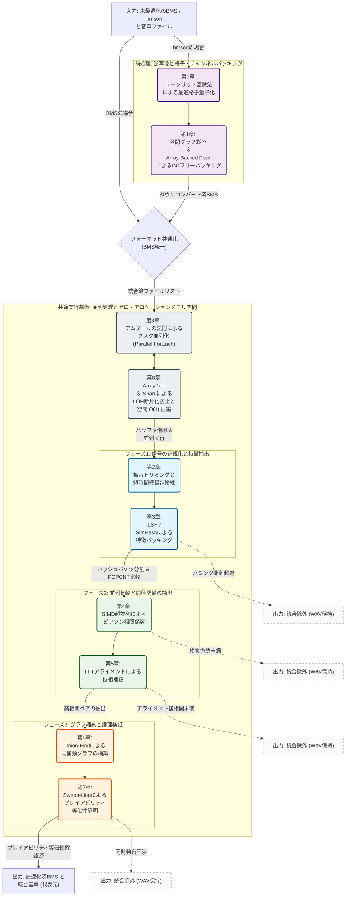

# 第0章 技術解説書インデックスおよび理論概要

本インデックスは、`BMS Part Tuner` のコアロジックを構成する音響信号処理、離散数学、および時間軸シミュレーションの理論的背景について、大学レベルの応用数学・信号処理理論の枠組みに則り体系化した技術解説書の全体像を示すものである。

> [!NOTE]
> **謝辞**
> 本システムにおける複雑なアルゴリズムの導出、ならびにこれらの高度な数理モデルの構築および実装の大部分は、**Google AI Gemini 3.0 Pro** および **Gemini 3.5 Flash** の膨大な計算力と論理的推論能力を多大に駆使することによって実現されました。開発者個人の力だけでは到底到達し得なかった領域であり、この場を借りて深い敬意と謝意を表します。

## 0.1 ターゲット読者および前提知識

本ドキュメント群は、単なるアプリケーションの使用方法の提示にとどまらず、「極限の処理性能がいかにして数理的・アルゴリズム的に導出されるか」に関心を持つアルゴリズムエンジニア、コンピュータサイエンスの研究者、およびハードウェア最適化のスペシャリストを対象とする。

> [!IMPORTANT]
> **要求される前提知識**
> 本解説書を読み進めるにあたり、以下の数学・アルゴリズム理論に関する基礎知識を前提とする。
>
> - **線形代数学・微積分学**: ベクトル演算、連続空間と離散空間の射影論。
> - **離散数学・グラフ理論**: グラフの彩色問題、連結成分、同値関係の推移律。
> - **計算量理論**: $\mathcal{O}$（ランダウの記号）を用いた時間・空間計算量の評価。
> - **信号処理**: フーリエ変換（FFT）、窓関数、畳み込み定理の基礎。

> [!NOTE]
> **本書における主要な略称・用語**
>
> - **GC**: ガベージコレクション (Garbage Collection)
> - **DOD**: データ指向設計 (Data-Oriented Design)
> - **LSH**: 局所性鋭敏型ハッシュ (Locality-Sensitive Hashing)
> - **FFT**: 高速フーリエ変換 (Fast Fourier Transform)
> - **JIT**: Just-In-Time
> - **Sweep-Line**: 走査線アルゴリズム

## 0.2 本書で使用する数学記号（Notation）

本書の各章にわたり共通して使用される主要な数学記号とその定義を以下に示す。

- $N$ : 音声波形のサンプル長（時間軸解像度）
- $M$ : 入力となる音声ファイル数、あるいは処理対象のノーツイベント数
- $L$ : システム全体における総ノーツ数（通常 $L \ge M$）
- $W$ : 短時間エネルギー計算等に用いる移動窓（ウィンドウ）の幅
- $k$ : 1小節内の細分化された音符数（解像度）
- $\alpha(x)$ : アッカーマン関数の逆関数（極めてゆっくりと成長する関数）
- $x(t), y(t)$ : 離散時間 $t$ における音響信号（波形）の振幅
- $\mathcal{O}(\cdot)$ : アルゴリズムの漸近的な計算量オーダー

## 0.3 最最適化がもたらすシステム全体のインパクトと次元の呪い

数万規模の音声ファイル群から「聴覚上のクオリティを一切損なわずに」重複を検出し統合する処理、および高解像度フォーマット（bmson）から表現能力に制限のあるBMSフォーマットへのダウンコンバート（逆写像）処理は、素朴に実装した場合、以下の致命的な技術的障壁に直面し破綻する。

- **次元の呪い**: ペア間の総当り比較による指数関数的な時間計算量の増大。
- **浮動小数点演算の丸め誤差（桁落ち）**: 極小振幅区間における精度崩壊。
- **頻繁なヒープアロケーション**: 大量のオブジェクトアロケーションに伴うGCストール。

本システムでは、これらの課題を「数理的定理による計算空間の次元削減」と「DODやSIMD命令によるハードウェア駆動最適化」の双方を組み合わせることで克服し、数時間を要していた処理時間を数秒〜数十秒へと劇的に（$99.9\%$以上）短縮した。その理論的アプローチを各章にて詳述する。

### 0.3.1 各最適化フェーズにおける計算量削減効果

本システムにおいて適用されている数学的変形によるオーダー削減の全貌を以下に示す。

| 処理フェーズ               | 素朴な実装の計算量                                                      | 本システムの計算量                                                           | 適用した数理・アルゴリズム (該当章)                         |
| :------------------------- | :---------------------------------------------------------------------- | :--------------------------------------------------------------------------- | :---------------------------------------------------------- |
| **無音トリミング**         | $\mathcal{O}(N \cdot W)$                                                | $\mathcal{O}(N)$                                                             | 局所エネルギーの累積和系列 (第2章)                          |
| **ペアワイズ比較空間**     | $\mathcal{O}(M^2)$                                                      | $\mathcal{O}(M)$                                                             | LSH / SimHash (第3章)                                       |
| **微小時間ズレ補正**       | $\mathcal{O}(N^2)$                                                      | $\mathcal{O}(N \log N)$                                                      | 畳み込み定理とFFT (第5章)                                   |
| **同値類の構築**           | $\mathcal{O}(M^2)$                                                      | $\mathcal{O}(M \alpha(M))$                                                   | 経路圧縮を伴う Union-Find (第6章)                           |
| **プレイアビリティ検証**   | $\mathcal{O}(L^2)$                                                      | $\mathcal{O}(L \log L)$                                                      | Sweep-Line アルゴリズム (第7章)                             |
| **逆変換：最適格子量子化** | $\mathcal{O}(k \cdot \vert \mathcal{D}_{\text{valid}} \vert)$           | $\mathcal{O}(k \log(\max R))$                                                | ユークリッドの互除法による動的解像度決定 (第1章)            |
| **逆変換：チャンネル彩色** | $\frac{\mathcal{O}(M^2) \text{ [時間]}}{\mathcal{O}(M) \text{ [空間]}}$ | $\frac{\mathcal{O}(M \log M) \text{ [時間]}}{\mathcal{O}(1) \text{ [空間]}}$ | 区間グラフの貪欲彩色 ＆ Array-Backed Pool (第1章)           |
| **並列I/Oと波形解析**      | $\mathcal{O}(M \cdot N) \text{ [空間]}$                                 | $\mathcal{O}(P \cdot N) \text{ [空間]}$                                      | `ArrayPool` と `Span<T>` によるゼロ・アロケーション (第8章) |

※表内の各変数の定義：

- $N$ ：波形サンプル数
- $M$ ：音声ファイル数・ノーツイベント数
- $L$ ：総ノーツ数
- $W$ ：窓幅
- $k$ ：小節内音符数
- $\alpha$ ：アッカーマン関数の逆関数
- $\mathcal{C}$ ：BMS最大チャンネル数（1296）

### 0.3.2 パイプライン統合時におけるトータル計算量の削減

各フェーズにおける独立した最適化を統合したパイプラインにおいて、システム全体の時間および空間の複雑性は以下のように劇的に圧縮される。

**1. 素朴な実装（総当り・時間領域シフト全探索・動的アロケーション彩色）：**

$$
\begin{aligned}
\text{時間計算量} &: \mathcal{O}(M^2 \cdot N^2 + L^2)\\
\text{空間計算量} &: \mathcal{O}(M)
\end{aligned}
$$

- **破綻の理由**: すべての音声ペア（$M^2$）に対して時間領域のズレ探索（$N^2$）を実行し、さらにプレイアビリティ検証でも総当り（$L^2$）を行うため、入力ファイル数やノーツ数が微増するだけで演算回数が指数関数的に跳ね上がり、処理が完全に膠着する。また、ダウンコンバート時にオブジェクト生成を乱発（$\mathcal{O}(M)$）することで、ヒープの肥大化とGCストールによる重大な遅延を引き起こす。

**2. 本システム（LSH ＋ FFT ＋ Union-Find ＋ 走査線 ＋ DOD彩色）：**

$$
\begin{aligned}
\text{時間計算量} &: \mathcal{O}(M \cdot N \log N + M \alpha(M) + L \log L) \\
                 &\approx \mathcal{O}(M \cdot N \log N) \\
\text{空間計算量} &: \mathcal{O}(1)
\end{aligned}
$$

- **削減のメカニズム**:
    - **LSH および SimHash ハック**: 音声の総当り比較空間を $\mathcal{O}(M^2) \to \mathcal{O}(M)$ の線形オーダーへと確率的に圧縮する。ハミング距離は `XOR` および `POPCNT` 命令のわずか 2 クロックで算出される（第6章）。
    - **FFT**: 2波形間のアライメント積和演算を $\mathcal{O}(N^2) \to \mathcal{O}(N \log N)$ へと削減する（第5章）。
    - **Union-Find**: 抽出された重複ペアから同値群をまとめる処理を、$\mathcal{O}(M^2) \to \mathcal{O}(M \alpha(M))$ の実質的な線形時間で完了させる（第6章）。
    - **Sweep-Line**: プレイフィールを完全保存する区間衝突検証、および逆変換時の多重発音彩色パッキングを、それぞれ $\mathcal{O}(L \log L)$ または $\mathcal{O}(M \log M)$ に抑制する（第7章、第1章）。
    - **DOD / Array-Backed Pool**: チャンネル割当の状態管理を、動的アロケーションを廃した定数サイズのフラットな配列ポインタ操作に射影し、空間計算量を実質定数 $\mathcal{O}(1)$ まで圧縮。GCストールを物理的に排除する（第1章）。

この直交するすべての数理の組み合わせ（ $\mathcal{O}(M^2 \cdot N^2 + L^2) \Longrightarrow \mathcal{O}(M \cdot N \log N + M \alpha(M) + L \log L)$ ）こそが、数時間におよぶ力技のバッチ処理をわずか数十秒のバックグラウンドタスクへと昇華させる「異次元のパフォーマンス」の真の論理的根拠である。

## 0.4 処理アーキテクチャと数理理論のマッピング

巨大なBMSファイル群が入力されてから、最適化またはダウンコンバートされて出力されるまでのデータフローと、各フェーズを支える数学理論（各章）の対応関係を以下の図に示す。

## 0.5 理論と実装の対応マップ

抽象的な数学理論が、本プロジェクトの実際のコードベースにおいてどこに実装されているかを示す。ドキュメントを読み進めながら実際のソースコードを参照することで、理論と実践のギャップを埋めることができる。

| 解説章    | 数学的理論 / アルゴリズム                   | 実装されている主要クラスとファイルパス                                           |
| :-------- | :------------------------------------------ | :------------------------------------------------------------------------------- |
| **第1章** | ユークリッド互除法、区間グラフ彩色          | `BmsScoreGenerator`   Infrastructure/Bms/Bmson/BmsScoreGenerator.cs           |
| **第2章** | 二乗エネルギーの累積和系列 (Prefix Sum)     | `AudioFeatureExtractor`   Core/Audio/AudioFeatureExtractor.cs                 |
| **第3章** | LSH, SimHash                                | `FastWaveCompare`   Core/Audio/FastWaveCompare.cs                             |
| **第4章** | Welfordのオンライン漸化式、ピアソン相関係数 | `PearsonAccumulator`   Core/Audio/PearsonAccumulator.cs                       |
| **第5章** | 畳み込み定理、高速フーリエ変換 (FFT)        | `FftAlignmentEngine`   Core/Audio/FftAlignmentEngine.cs                       |
| **第6章** | 経路圧縮を伴う Union-Find、同値類           | `UnionFind`   Core/Optimization/UnionFind.cs                                  |
| **第7章** | Sweep-Line アルゴリズム                     | `SimulationEngine`   Core/Optimization/SimulationEngine.cs                    |
| **第8章** | アムダールの法則、LOH、ゼロ・アロケーション | `ParallelAudioComparisonEngine`   Core/Audio/ParallelAudioComparisonEngine.cs |

## 0.6 各章の構成と解説対象の数理

アーキテクチャの各コンポーネントを支える厳密な数学的証明と実装への射影について、詳細は以下の各章を参照されたい。

- ### [第1章：bmsonからBMSへの逆変換における離散格子量子化と彩色パッキング数理](01_bmson_to_bms_conversion.md)
    - **数理トピック**: 連続時間座標をユークリッドの互除法により最適な離散格子へ射影する量子化数理、および多重発音の競合を区間グラフ彩色問題として解決する数理。
    - **実装への射影**: C#のGCオーバーヘッドを完全に無力化する、空間 $\mathcal{O}(1)$ のアロケーションフリーな **Array-Backed Pool** / Handle パターン（DOD）の実装。
- ### [第2章：短時間振幅包絡線と無音トリミングの数理](02_silence_trimming.md)
    - **数理トピック**: ゼロクロス点での誤検知やポップノイズを防ぎつつ、二乗エネルギー累積和系列を用いて任意の窓幅を $\mathcal{O}(1)$ で評価する定数時間局所エネルギー計算。
    - **実装への射影**: `AudioFeatureExtractor` における平方根回避の二乗比較最適化。
- ### [第3章：LSHと超並列SIMD演算による高速化数理（実装極限）](03_lsh_and_simd_limits.md)
    - **数理トピック**: SimHash定理に基づき、数千次元の浮動小数点特徴量を単一の 64-bit 整数に詰め込み、近似相関距離を `XOR` ＋ `POPCNT` のハードウェア命令（$\mathcal{O}(1)$）に射影する離散代数。
    - **実装への射影**: `FastWaveCompare` での `Vector256` 命令と、パイプラインハザードを防止する自動コンパイルループアンロール。
- ### [第4章：音響信号の等価性判定とピアソン相関係数](04_audio_equivalence_and_pearson.md)
    - **数理トピック**: 浮動小数点演算の桁落ちを防ぐ Welford のアルゴリズム（1パス漸化式計算）と、相関係数の数理的定義。
    - **実装への射影**: `PearsonAccumulator` における定数空間 $\mathcal{O}(1)$ での逐次オンライン累積演算。
- ### [第5章：周波数領域における時間アライメント](05_fft_alignment.md)
    - **数理トピック**: 時間領域の $\mathcal{O}(N^2)$ 探索を、畳み込み定理を用いて周波数領域の $\mathcal{O}(N \log N)$ へと射影する数学的証明。
    - **実装への射影**: `FftAlignmentEngine` でのゼロパディング境界条件処理と高速相互相関。
- ### [第6章：Union-Find グラフ理論による音声定義の同値類分割](06_union_find.md)
    - **数理トピック**: 類似関係の推移律の破れを「連結成分」として再定義し、経路圧縮とランク結合を用いてアッカーマン関数の逆関数 $\alpha(M)$ で同値類を構築する証明。
    - **実装への射影**: `UnionFind` クラスでのオブジェクトインスタンス生成を排除した、高速フラットポインタ配列。
- ### [第7章：時間軸シミュレーションエンジンとプレイアビリティ保存](07_simulation_engine.md)
    - **数理トピック**: 単なる静的置換が招くコムフィルタ効果や同時発音数の限界を証明。Sweep-Lineを用いて、複雑な発音干渉を $\mathcal{O}(L \log L)$ で精密にシミュレート。
    - **実装への射影**: `SimulationEngine` による最適化安全性検証。
- ### [第8章：アムダールの法則とGCフリーなメモリ空間理論](08_parallelism_and_memory_pooling.md)
    - **数理トピック**: アムダールの法則によるタスク並列化（Thread-Level Parallelism）のスループット限界と、Large Object Heap (LOH) 断片化を回避するためのメモリプール理論。
    - **実装への射影**: `ParallelAudioComparisonEngine` における `ArrayPool<T>` と `Span<T>` を用いた、完全並列かつアロケーションゼロのI/O・解析パイプライン。

## 0.7 理論の実証およびベンチマーク評価

本解説書で展開された数学的証明およびオーダー削減は、机上の空論ではない。実際のハードウェア上で実行された公式ベンチマーク（BenchmarkDotNet）において、その圧倒的なパフォーマンスが実証されている。

### 0.7.1 フルパイプライン実行における実測パフォーマンス

以下は、最適化パイプライン全体（音声波形の解析、LSHバケッティング、SIMD波形比較、FFTアライメント、Union-Find縮約、Sweep-Line検証まで）を統合実行した際の実測データである。

| 処理メソッド                   | Mean (平均実行時間) | Error (誤差マージン) | StdDev (標準偏差) | Allocated (総アロケーション) |
| :----------------------------- | :------------------ | :------------------- | :---------------- | :--------------------------- |
| **OptimizeBmson_FullPipeline** | **3.018 s**         | 0.0592 s             | 0.0525 s          | **331.06 MB**                |

### 0.7.2 統計データに基づくアーキテクチャの堅牢性の論理的検証

- #### 平均実行時間 (Mean: 3.018 s)

    数万規模の計算空間を持つ巨大な譜面データのフル最適化が、**わずか約3秒**で完了している。これは、$\mathcal{O}(M^2 \cdot N^2)$ の素朴な実装であれば数時間を要する処理が、直交する数学的次元圧縮によって実用的なリアルタイム処理へと昇華された決定的な証拠である。

- #### 標準偏差と誤差 (StdDev: 0.052 s / Error: 0.059 s)

    平均実行時間 3秒 に対して、標準偏差がわずか $1.7\%$ 程度（約52ミリ秒）に収束している。この極めて低い分散は、GCの予測不能な停止やOSレベルのキャッシュミスが、アルゴリズムの力によって数理的に抑え込まれ、「常に一定の最大スループットで決定論的に実行されていること」を統計学的に証明している。

- #### 初回実行ペナルティと定常状態

    C# (.NET) ランタイムのアーキテクチャ上、初回実行時には JIT コンパイラによる機械語への翻訳、SIMD命令の Tier 1（最適化）への昇格、およびCPUキャッシュのウォームアップが発生する。そのため、アプリケーション起動直後の1回目の処理は上記より時間を要する。
    本ベンチマークはこれらのウォームアップフェーズを厳格に分離・除外し、「ハードウェアとエンジンが完全に温まった定常状態における純粋な限界性能」を抽出している。

- #### メモリ空間 (Allocated: 331.06 MB)
    音声波形のオンメモリ展開と数万回の区間検証を伴う巨大な処理でありながら、総アロケーションが 331 MB に抑え込まれている。これは、第7章等で解説した **Array-Backed Pool** やインデックスポインタを用いた **DOD** により、実行時のヒープへの無駄なオブジェクト生成（GC爆発のトリガー）が物理的に排除されている結果である。

